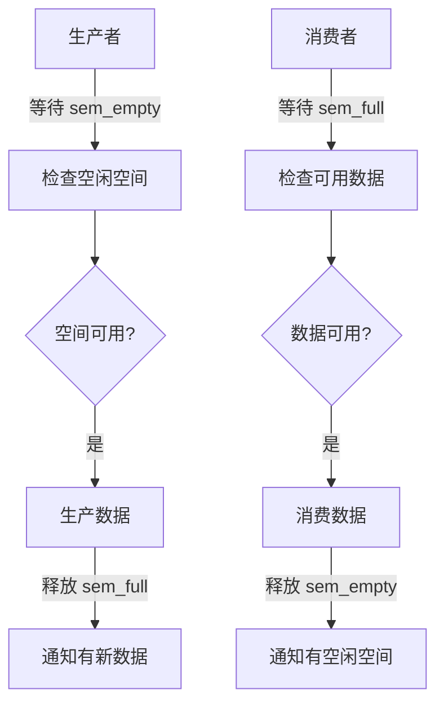
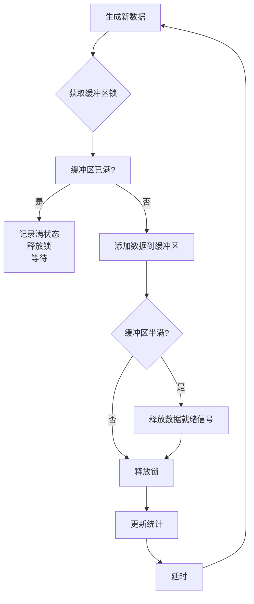
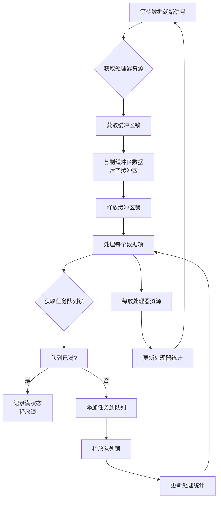

---
up:
  - "[[../moc/MocRtos|MocRtos]]"
---


好的，以下是一些使用 RT-Thread 中的信号量锁（Semaphore Lock）和信号量（Semaphore）的示例代码，帮助你更好地理解它们的使用方法和区别。

### 示例 1：使用信号量锁（Semaphore Lock）

假设我们有一个共享资源，需要多个线程安全地访问它。我们可以使用信号量锁来保护这个共享资源。

#### 定义共享资源和信号量锁
```c
#include <rtthread.h>

#define SHARED_RESOURCE_SIZE 10
int shared_resource[SHARED_RESOURCE_SIZE];
rt_sem_t resource_lock;
```
rt_sem_t resource_lock;
#### 初始化信号量锁
```c
void init_resource_lock(void)
{
    resource_lock = rt_sem_create("resource_lock", 1, RT_IPC_FLAG_FIFO);
    if (resource_lock == RT_NULL)
    {
        rt_kprintf("Failed to create semaphore lock\n");
    }
}
```
**value为1**
#### 线程函数：访问共享资源
```c
void thread1(void *parameter)
{
    while (1)
    {
        // 请求信号量锁
        rt_sem_take(resource_lock, RT_WAITING_FOREVER);

        // 访问共享资源
        for (int i = 0; i < SHARED_RESOURCE_SIZE; i++)
        {
            shared_resource[i]++;
        }

        // 释放信号量锁
        rt_sem_release(resource_lock);

        // 延时一段时间
        rt_thread_mdelay(1000);
    }
}

void thread2(void *parameter)
{
    while (1)
    {
        // 请求信号量锁
        rt_sem_take(resource_lock, RT_WAITING_FOREVER);

        // 访问共享资源
        for (int i = 0; i < SHARED_RESOURCE_SIZE; i++)
        {
            shared_resource[i]--;
        }

        // 释放信号量锁
        rt_sem_release(resource_lock);

        // 延时一段时间
        rt_thread_mdelay(1000);
    }
}
```
两个线程都一样
1. **请求信号量锁**   rt_sem_take(resource_lock, RT_WAITING_FOREVER);
2. **访问共享资源**
3. **释放信号量锁**   rt_sem_release(resource_lock);
#### 主函数：创建线程
```c
int main(void)
{
    init_resource_lock();

    rt_thread_t tid1 = rt_thread_create("thread1", thread1, NULL, 1024, 10, 5);
    if (tid1 != RT_NULL)
    {
        rt_thread_startup(tid1);
    }

    rt_thread_t tid2 = rt_thread_create("thread2", thread2, NULL, 1024, 10, 5);
    if (tid2 != RT_NULL)
    {
        rt_thread_startup(tid2);
    }

    return 0;
}
```

### 示例 2：使用信号量（Semaphore）

假设我们有一个生产者-消费者模型，生产者线程生成数据并将其放入缓冲区，消费者线程从缓冲区中取出数据并处理它。我们可以使用信号量来同步生产者和消费者。

#### 定义缓冲区和信号量
```c
#include <rtthread.h>

#define BUFFER_SIZE 10
int buffer[BUFFER_SIZE];
int in = 0, out = 0;
rt_sem_t sem_full, sem_empty;
```
rt_sem_t sem_full, sem_empty;
#### 初始化信号量
```c
void init_semaphores(void)
{
    sem_full = rt_sem_create("sem_full", 0, RT_IPC_FLAG_FIFO);
    if (sem_full == RT_NULL)
    {
        rt_kprintf("Failed to create full semaphore\n");
    }

    sem_empty = rt_sem_create("sem_empty", BUFFER_SIZE, RT_IPC_FLAG_FIFO);
    if (sem_empty == RT_NULL)
    {
        rt_kprintf("Failed to create empty semaphore\n");
    }
}
```

#### 生产者线程函数
```c
void producer(void *parameter)
{
    while (1)
    {
        // 等待空闲缓冲区
        rt_sem_take(sem_empty, RT_WAITING_FOREVER);

        // 生产数据
        buffer[in] = in;
        in = (in + 1) % BUFFER_SIZE;

        // 释放满信号量
        rt_sem_release(sem_full);

        // 延时一段时间
        rt_thread_mdelay(1000);
    }
}
```

1. 等待空闲缓冲区
2. 生产数据
3. 释放满信号量 
#### 消费者线程函数
```c
void consumer(void *parameter)
{
    while (1)
    {
        // 等待缓冲区中有数据
        rt_sem_take(sem_full, RT_WAITING_FOREVER);

        // 消费数据
        int data = buffer[out];
        out = (out + 1) % BUFFER_SIZE;

        // 释放空信号量
        rt_sem_release(sem_empty);

        // 延时一段时间
        rt_thread_mdelay(1000);

        // 打印消费的数据
        rt_kprintf("Consumed data: %d\n", data);
    }
}
```
1. 等待缓冲区有数据 
2. 消费数据
3. 释放空信号量

#### 主函数：创建线程
```c
int main(void)
{
    init_semaphores();

    rt_thread_t producer_thread = rt_thread_create("producer", producer, NULL, 1024, 10, 5);
    if (producer_thread != RT_NULL)
    {
        rt_thread_startup(producer_thread);
    }

    rt_thread_t consumer_thread = rt_thread_create("consumer", consumer, NULL, 1024, 10, 5);
    if (consumer_thread != RT_NULL)
    {
        rt_thread_startup(consumer_thread);
    }

    return 0;
}
```


### 总结

- **信号量锁**：用于保护共享资源，确保同一时间只有一个线程可以访问该资源。在示例1中，我们使用信号量锁保护了一个共享数组，确保多个线程安全地访问它。
- **信号量**：用于同步线程，允许多个线程同时访问共享资源，只要信号量的值大于0。在示例2中，我们使用信号量同步了生产者和消费者线程，确保生产者不会在缓冲区满时继续生产，消费者不会在缓冲区空时继续消费。

这两个示例展示了信号量锁和信号量在不同场景下的使用方法。理解它们的区别和用途，有助于在实际开发中选择合适的同步机制，确保系统的线程安全和高效运行。


# 为什么使用 sem_full 和 sem_empty 两个信号量？

在生产者-消费者模型中同时使用 `sem_full` 和 `sem_empty` 两个信号量是一种经典的同步机制设计，这种设计有明确的理由和优势：

## 核心原因：解决两个维度的同步问题

1. **`sem_empty` 控制生产者**
   - 跟踪缓冲区中**空闲位置的数量**
   - 初始值 = 缓冲区大小
   - 生产者生产前必须获取 `sem_empty`
   - 消费者消费后释放 `sem_empty`

2. **`sem_full` 控制消费者**
   - 跟踪缓冲区中**已填充位置的数量**
   - 初始值 = 0
   - 消费者消费前必须获取 `sem_full`
   - 生产者生产后释放 `sem_full`

## 为什么需要两个信号量而不是一个？

| 场景           | 单信号量问题       | 双信号量解决方案             |
| ------------ | ------------ | -------------------- |
| **缓冲区满时**    | 生产者可能覆盖未消费数据 | `sem_empty` 为0时阻塞生产者 |
| **缓冲区空时**    | 消费者可能读取无效数据  | `sem_full` 为0时阻塞消费者  |
| **多生产者/消费者** | 难以协调生产/消费速率  | 两个信号量各自独立控制流程        |
| **缓冲区大小变化**  | 无法适应动态缓冲区    | 信号量值自动反映缓冲区状态        |

## 信号量工作流程



## 实际示例分析

假设缓冲区大小为5：

```c
// 初始化
sem_empty = 5  // 5个空闲位置
sem_full = 0   // 0个填充位置

// 生产者生产一个数据：
1. 等待 sem_empty -> 成功（sem_empty=4）
2. 生产数据
3. 释放 sem_full -> sem_full=1

// 消费者消费一个数据：
1. 等待 sem_full -> 成功（sem_full=0）
2. 消费数据
3. 释放 sem_empty -> sem_empty=5
```

## 为什么需要额外的互斥锁？

虽然两个信号量解决了生产者和消费者之间的同步问题，但它们**不能解决并发访问问题**：

1. 当多个生产者同时尝试修改 `in` 索引时
2. 当多个消费者同时尝试修改 `out` 索引时
3. 当生产者和消费者同时访问缓冲区时

因此需要互斥锁来保护临界区：
```c
// 生产者临界区
rt_mutex_take(buffer_mutex);
buffer[in] = item;
in = (in + 1) % BUFFER_SIZE;
rt_mutex_release(buffer_mutex);

// 消费者临界区
rt_mutex_take(buffer_mutex);
item = buffer[out];
out = (out + 1) % BUFFER_SIZE;
rt_mutex_release(buffer_mutex);
```

## 总结：双信号量的优势

1. **明确的资源计数**：分别跟踪空闲和已用空间
2. **防止缓冲区溢出**：`sem_empty` 确保生产者不会在满缓冲区时写入
3. **防止缓冲区下溢**：`sem_full` 确保消费者不会在空缓冲区时读取
4. **高效的线程调度**：线程只在必要时唤醒
5. **适应不同速率**：允许生产者和消费者以不同速度运行
6. **可扩展性**：轻松支持多个生产者和消费者

这种双信号量模式是操作系统和并发编程中的经典解决方案，它提供了高效、安全的线程同步机制，特别适合生产者-消费者这类资源管理场景。


# RT-Thread 信号量使用实例详解

下面是一个完整的 RT-Thread 信号量使用实例，展示了信号量在资源访问控制、线程同步和生产者-消费者模型中的实际应用。

## 信号量基本概念

信号量是一种用于线程同步的机制，主要功能：
- **计数功能**：跟踪可用资源的数量
- **同步功能**：控制线程的执行顺序
- **互斥功能**：保护共享资源（通常使用二进制信号量）

## 实例代码：信号量在多种场景的应用

```c
#include <rtthread.h>
#include <rtdevice.h>

/* 定义线程控制块 */
static rt_thread_t thread1 = RT_NULL;
static rt_thread_t thread2 = RT_NULL;
static rt_thread_t producer_thread = RT_NULL;
static rt_thread_t consumer_thread = RT_NULL;

/* 定义信号量 */
static rt_sem_t sem_resource;    // 资源访问控制信号量
static rt_sem_t sem_sync;        // 线程同步信号量
static rt_sem_t sem_full;        // 生产者-消费者模型：满缓冲区信号量
static rt_sem_t sem_empty;       // 生产者-消费者模型：空缓冲区信号量

/* 生产者-消费者模型参数 */
#define BUFFER_SIZE 5
static rt_uint8_t buffer[BUFFER_SIZE];
static rt_uint8_t in = 0, out = 0;
static rt_mutex_t buffer_mutex;  // 保护缓冲区的互斥锁

/* 资源访问控制示例 */
static void resource_access_thread(void *parameter)
{
    while (1)
    {
        // 等待获取资源访问权
        rt_sem_take(sem_resource, RT_WAITING_FOREVER);
        
        rt_kprintf("Thread %d acquired resource\n", (rt_uint32_t)parameter);
        
        // 模拟资源使用
        rt_thread_mdelay(200);
        
        rt_kprintf("Thread %d released resource\n", (rt_uint32_t)parameter);
        
        // 释放资源访问权
        rt_sem_release(sem_resource);
        
        rt_thread_mdelay(500);
    }
}

/* 线程同步示例 */
static void sync_thread1(void *parameter)
{
    while (1)
    {
        rt_kprintf("Thread 1: Performing task A\n");
        rt_thread_mdelay(300);
        
        // 通知线程2任务A已完成
        rt_sem_release(sem_sync);
        
        // 等待线程2完成任务B
        rt_sem_take(sem_sync, RT_WAITING_FOREVER);
        
        rt_kprintf("Thread 1: Received notification, continuing...\n");
        rt_thread_mdelay(1000);
    }
}

static void sync_thread2(void *parameter)
{
    while (1)
    {
        // 等待线程1完成任务A
        rt_sem_take(sem_sync, RT_WAITING_FOREVER);
        
        rt_kprintf("Thread 2: Performing task B\n");
        rt_thread_mdelay(400);
        
        // 通知线程1任务B已完成
        rt_sem_release(sem_sync);
        
        rt_thread_mdelay(800);
    }
}

/* 生产者线程函数 */
static void producer(void *parameter)
{
    rt_uint8_t item = 0;
    
    while (1)
    {
        // 生产一个数据项
        item++;
        
        // 等待空闲缓冲区
        rt_sem_take(sem_empty, RT_WAITING_FOREVER);
        
        // 获取缓冲区访问锁
        rt_mutex_take(buffer_mutex, RT_WAITING_FOREVER);
        
        // 将数据放入缓冲区
        buffer[in] = item;
        in = (in + 1) % BUFFER_SIZE;
        
        rt_kprintf("Producer: added item %d (buffer: %d/%d)\n", 
                  item, 
                  (in - out + BUFFER_SIZE) % BUFFER_SIZE,
                  BUFFER_SIZE);
        
        // 释放缓冲区访问锁
        rt_mutex_release(buffer_mutex);
        
        // 通知消费者有新数据可用
        rt_sem_release(sem_full);
        
        // 模拟生产耗时
        rt_thread_mdelay(800);
    }
}

/* 消费者线程函数 */
static void consumer(void *parameter)
{
    rt_uint8_t item;
    
    while (1)
    {
        // 等待缓冲区中有数据
        rt_sem_take(sem_full, RT_WAITING_FOREVER);
        
        // 获取缓冲区访问锁
        rt_mutex_take(buffer_mutex, RT_WAITING_FOREVER);
        
        // 从缓冲区取出数据
        item = buffer[out];
        out = (out + 1) % BUFFER_SIZE;
        
        rt_kprintf("Consumer: processed item %d (buffer: %d/%d)\n", 
                  item,
                  (in - out + BUFFER_SIZE) % BUFFER_SIZE,
                  BUFFER_SIZE);
        
        // 释放缓冲区访问锁
        rt_mutex_release(buffer_mutex);
        
        // 通知生产者有空闲缓冲区
        rt_sem_release(sem_empty);
        
        // 模拟消费耗时
        rt_thread_mdelay(1200);
    }
}

/* 初始化信号量和互斥锁 */
static void init_sync_objects(void)
{
    // 资源访问控制信号量（二进制信号量）
    sem_resource = rt_sem_create("res_sem", 1, RT_IPC_FLAG_FIFO);
    if (sem_resource == RT_NULL)
    {
        rt_kprintf("Failed to create resource semaphore\n");
    }
    
    // 线程同步信号量
    sem_sync = rt_sem_create("sync_sem", 0, RT_IPC_FLAG_FIFO);
    if (sem_sync == RT_NULL)
    {
        rt_kprintf("Failed to create sync semaphore\n");
    }
    
    // 生产者-消费者信号量
    sem_empty = rt_sem_create("sem_empty", BUFFER_SIZE, RT_IPC_FLAG_FIFO);
    sem_full = rt_sem_create("sem_full", 0, RT_IPC_FLAG_FIFO);
    if (sem_empty == RT_NULL || sem_full == RT_NULL)
    {
        rt_kprintf("Failed to create producer-consumer semaphores\n");
    }
    
    // 缓冲区互斥锁
    buffer_mutex = rt_mutex_create("buf_mutex", RT_IPC_FLAG_FIFO);
    if (buffer_mutex == RT_NULL)
    {
        rt_kprintf("Failed to create buffer mutex\n");
    }
}

int main(void)
{
    // 初始化所有同步对象
    init_sync_objects();
    
    // 创建资源访问控制线程
    thread1 = rt_thread_create("res_thread1", resource_access_thread, (void*)1, 
                              1024, 20, 10);
    thread2 = rt_thread_create("res_thread2", resource_access_thread, (void*)2, 
                              1024, 20, 10);
    
    // 创建同步线程
    rt_thread_t sync1 = rt_thread_create("sync_thread1", sync_thread1, RT_NULL, 
                                       1024, 22, 10);
    rt_thread_t sync2 = rt_thread_create("sync_thread2", sync_thread2, RT_NULL, 
                                       1024, 21, 10);
    
    // 创建生产者-消费者线程
    producer_thread = rt_thread_create("producer", producer, RT_NULL, 
                                     1024, 25, 10);
    consumer_thread = rt_thread_create("consumer", consumer, RT_NULL, 
                                     1024, 26, 10);
    
    // 启动所有线程
    if (thread1) rt_thread_startup(thread1);
    if (thread2) rt_thread_startup(thread2);
    if (sync1) rt_thread_startup(sync1);
    if (sync2) rt_thread_startup(sync2);
    if (producer_thread) rt_thread_startup(producer_thread);
    if (consumer_thread) rt_thread_startup(consumer_thread);
    
    return 0;
}
```

## 信号量使用场景解析

### 1. 资源访问控制（二进制信号量）

```c
// 创建二进制信号量（初始值为1）
sem_resource = rt_sem_create("res_sem", 1, RT_IPC_FLAG_FIFO);

// 线程中使用
rt_sem_take(sem_resource, RT_WAITING_FOREVER); // 获取资源访问权
// ... 访问共享资源 ...
rt_sem_release(sem_resource); // 释放资源访问权
```

**功能**：确保同一时间只有一个线程可以访问关键资源（类似互斥锁）

**输出示例**：
```
Thread 1 acquired resource
Thread 1 released resource
Thread 2 acquired resource
Thread 2 released resource
```

### 2. 线程同步

```c
// 创建同步信号量（初始值为0）
sem_sync = rt_sem_create("sync_sem", 0, RT_IPC_FLAG_FIFO);

// 线程1中
// ... 完成任务A ...
rt_sem_release(sem_sync); // 通知线程2

// 线程2中
rt_sem_take(sem_sync, RT_WAITING_FOREVER); // 等待线程1完成
// ... 完成任务B ...
rt_sem_release(sem_sync); // 通知线程1
```

**功能**：协调两个线程的执行顺序，确保任务A在任务B之前完成

**输出示例**：
```
Thread 1: Performing task A
Thread 2: Performing task B
Thread 1: Received notification, continuing...
```

### 3. 生产者-消费者模型（计数信号量）

```c
// 创建信号量
sem_empty = rt_sem_create("sem_empty", BUFFER_SIZE, RT_IPC_FLAG_FIFO); // 初始空闲数=缓冲区大小
sem_full = rt_sem_create("sem_full", 0, RT_IPC_FLAG_FIFO); // 初始满数=0

// 生产者
rt_sem_take(sem_empty, RT_WAITING_FOREVER); // 等待空位
// ... 生产数据 ...
rt_sem_release(sem_full); // 通知有新数据

// 消费者
rt_sem_take(sem_full, RT_WAITING_FOREVER); // 等待数据
// ... 消费数据 ...
rt_sem_release(sem_empty); // 通知有空位
```

**功能**：协调生产者和消费者的速度，防止缓冲区溢出或下溢

**输出示例**：
```
Producer: added item 1 (buffer: 1/5)
Consumer: processed item 1 (buffer: 0/5)
Producer: added item 2 (buffer: 1/5)
Producer: added item 3 (buffer: 2/5)
Consumer: processed item 2 (buffer: 1/5)
```

## 信号量使用注意事项

1. **初始化值选择**：
   - 二进制信号量：初始值通常为1
   - 同步信号量：初始值通常为0
   - 资源计数：初始值=可用资源数量

2. **等待时间设置**：
   - `RT_WAITING_FOREVER`：无限等待
   - `RT_WAITING_NO`：不等待，立即返回
   - 具体时间值：等待指定时间（tick数）

3. **优先级反转问题**：
   - 高优先级线程等待低优先级线程释放信号量时发生
   - 解决方案：使用互斥锁（mutex）的优先级继承特性

4. **死锁预防**：
   - 避免嵌套获取多个信号量
   - 按固定顺序获取信号量
   - 设置合理的超时时间

5. **信号量删除**：
   - 确保没有线程在等待信号量后再删除
   - 使用 `rt_sem_delete()` 释放资源

## 信号量 vs 互斥锁

| 特性 | 信号量 | 互斥锁 |
|------|--------|--------|
| **所有权** | 无所有权概念 | 有所有权（只有获取者能释放） |
| **优先级继承** | 不支持 | 支持（防止优先级反转） |
| **计数功能** | 支持（计数信号量） | 只支持二进制（0/1） |
| **典型用途** | 线程同步、资源计数 | 共享资源互斥访问 |
| **释放操作** | 任何线程都可释放 | 只能由获取者释放 |

## 总结

信号量是 RT-Thread 中强大的线程同步工具，本实例展示了三种典型应用场景：
1. **资源访问控制**：使用二进制信号量保护共享资源
2. **线程执行同步**：使用信号量协调线程执行顺序
3. **生产者-消费者模型**：使用双信号量管理缓冲区

实际开发中，应根据具体需求选择合适的同步机制：
- 需要简单的资源计数 → 计数信号量
- 需要严格的互斥访问 → 互斥锁
- 需要线程间事件通知 → 信号量（初始值0）

正确使用信号量可以显著提高系统的可靠性和效率，避免资源冲突和竞争条件。


# RT-Thread 多线程信号量应用实例：多个生产者和消费者

下面是一个包含多个生产者和消费者的完整示例，展示了信号量在多线程环境中的实际应用。这个实例扩展了传统的生产者-消费者模型，支持多个生产者线程和多个消费者线程同时工作。

```c
#include <rtthread.h>
#include <rtdevice.h>

/* 配置参数 */
#define BUFFER_SIZE         8   // 缓冲区大小
#define PRODUCER_COUNT      3   // 生产者线程数量
#define CONSUMER_COUNT      4   // 消费者线程数量
#define THREAD_STACK_SIZE   512 // 线程栈大小
#define THREAD_PRIORITY     25  // 线程优先级

/* 缓冲区和索引 */
static rt_uint8_t buffer[BUFFER_SIZE];
static rt_uint8_t in = 0, out = 0;

/* 信号量和互斥锁 */
static rt_sem_t sem_empty;      // 空缓冲区信号量
static rt_sem_t sem_full;       // 满缓冲区信号量
static rt_mutex_t buffer_mutex; // 缓冲区互斥锁

/* 统计信息 */
static rt_uint32_t total_produced = 0;
static rt_uint32_t total_consumed = 0;

/* 生产者线程函数 */
static void producer_thread_entry(void *parameter)
{
    rt_uint32_t producer_id = (rt_uint32_t)parameter;
    rt_uint8_t item = 0;
    
    while (1)
    {
        // 等待空闲缓冲区
        rt_sem_take(sem_empty, RT_WAITING_FOREVER);
        
        // 获取缓冲区访问锁
        rt_mutex_take(buffer_mutex, RT_WAITING_FOREVER);
        
        // 生产数据
        item = (rt_tick_get() % 100); // 模拟数据
        buffer[in] = item;
        in = (in + 1) % BUFFER_SIZE;
        total_produced++;
        
        rt_kprintf("Producer %d: item %d (buff: %d/%d)\n", 
                  producer_id, item, 
                  (in - out + BUFFER_SIZE) % BUFFER_SIZE, 
                  BUFFER_SIZE);
        
        // 释放缓冲区访问锁
        rt_mutex_release(buffer_mutex);
        
        // 通知消费者有新数据
        rt_sem_release(sem_full);
        
        // 模拟生产耗时（不同生产者速度不同）
        rt_thread_mdelay(300 + (producer_id * 100));
    }
}

/* 消费者线程函数 */
static void consumer_thread_entry(void *parameter)
{
    rt_uint32_t consumer_id = (rt_uint32_t)parameter;
    rt_uint8_t item;
    
    while (1)
    {
        // 等待缓冲区中有数据
        rt_sem_take(sem_full, RT_WAITING_FOREVER);
        
        // 获取缓冲区访问锁
        rt_mutex_take(buffer_mutex, RT_WAITING_FOREVER);
        
        // 消费数据
        item = buffer[out];
        out = (out + 1) % BUFFER_SIZE;
        total_consumed++;
        
        rt_kprintf("Consumer %d: item %d (buff: %d/%d) Total: P:%d/C:%d\n", 
                  consumer_id, item,
                  (in - out + BUFFER_SIZE) % BUFFER_SIZE, 
                  BUFFER_SIZE,
                  total_produced, total_consumed);
        
        // 释放缓冲区访问锁
        rt_mutex_release(buffer_mutex);
        
        // 通知生产者有空闲缓冲区
        rt_sem_release(sem_empty);
        
        // 模拟消费耗时（不同消费者速度不同）
        rt_thread_mdelay(400 + (consumer_id * 150));
    }
}

/* 监控线程函数（显示系统状态） */
static void monitor_thread_entry(void *parameter)
{
    while (1)
    {
        rt_thread_mdelay(5000); // 每5秒报告一次
        
        rt_kprintf("\n===== System Status =====\n");
        rt_kprintf("Buffer usage: %d/%d\n", 
                  (in - out + BUFFER_SIZE) % BUFFER_SIZE, 
                  BUFFER_SIZE);
        rt_kprintf("Total produced: %d\n", total_produced);
        rt_kprintf("Total consumed: %d\n", total_consumed);
        rt_kprintf("Sem empty count: %d\n", rt_sem_get_value(sem_empty));
        rt_kprintf("Sem full count: %d\n", rt_sem_get_value(sem_full));
        rt_kprintf("=========================\n\n");
    }
}

/* 初始化同步对象 */
static void init_sync_objects(void)
{
    // 创建空缓冲区信号量（初始值=缓冲区大小）
    sem_empty = rt_sem_create("sem_empty", BUFFER_SIZE, RT_IPC_FLAG_FIFO);
    if (sem_empty == RT_NULL)
    {
        rt_kprintf("Failed to create empty semaphore\n");
        return;
    }
    
    // 创建满缓冲区信号量（初始值=0）
    sem_full = rt_sem_create("sem_full", 0, RT_IPC_FLAG_FIFO);
    if (sem_full == RT_NULL)
    {
        rt_kprintf("Failed to create full semaphore\n");
        return;
    }
    
    // 创建缓冲区互斥锁
    buffer_mutex = rt_mutex_create("buf_mutex", RT_IPC_FLAG_PRIO);
    if (buffer_mutex == RT_NULL)
    {
        rt_kprintf("Failed to create buffer mutex\n");
        return;
    }
}

/* 主函数 */
int main(void)
{
    rt_thread_t thread;
    rt_uint32_t i;
    
    // 初始化同步对象
    init_sync_objects();
    
    // 创建生产者线程
    for (i = 0; i < PRODUCER_COUNT; i++)
    {
        char name[RT_NAME_MAX];
        rt_snprintf(name, RT_NAME_MAX, "prod%d", i);
        
        thread = rt_thread_create(name, 
                                producer_thread_entry, 
                                (void *)i,
                                THREAD_STACK_SIZE,
                                THREAD_PRIORITY - 1,  // 生产者优先级略高
                                10);
        if (thread != RT_NULL)
        {
            rt_thread_startup(thread);
        }
    }
    
    // 创建消费者线程
    for (i = 0; i < CONSUMER_COUNT; i++)
    {
        char name[RT_NAME_MAX];
        rt_snprintf(name, RT_NAME_MAX, "cons%d", i);
        
        thread = rt_thread_create(name, 
                                consumer_thread_entry, 
                                (void *)i,
                                THREAD_STACK_SIZE,
                                THREAD_PRIORITY,
                                10);
        if (thread != RT_NULL)
        {
            rt_thread_startup(thread);
        }
    }
    
    // 创建监控线程
    thread = rt_thread_create("monitor", 
                            monitor_thread_entry, 
                            RT_NULL,
                            THREAD_STACK_SIZE,
                            THREAD_PRIORITY + 1,  // 最低优先级
                            10);
    if (thread != RT_NULL)
    {
        rt_thread_startup(thread);
    }
    
    return 0;
}
```

## 实例解析：多线程信号量应用

### 1. 多生产者-多消费者模型

```c
#define PRODUCER_COUNT      3   // 3个生产者线程
#define CONSUMER_COUNT      4   // 4个消费者线程
```

**关键组件**：
- **sem_empty**：跟踪空闲缓冲区数量（初始值=BUFFER_SIZE）
- **sem_full**：跟踪已填充缓冲区数量（初始值=0）
- **buffer_mutex**：保护缓冲区和索引的互斥锁

### 2. 生产者线程工作流程

```c
void producer_thread_entry(void *parameter)
{
    // 1. 等待空闲缓冲区 (sem_empty)
    rt_sem_take(sem_empty, RT_WAITING_FOREVER);
    
    // 2. 获取缓冲区锁
    rt_mutex_take(buffer_mutex, RT_WAITING_FOREVER);
    
    // 3. 写入缓冲区
    buffer[in] = item;
    in = (in + 1) % BUFFER_SIZE;
    
    // 4. 释放缓冲区锁
    rt_mutex_release(buffer_mutex);
    
    // 5. 通知有新数据 (sem_full)
    rt_sem_release(sem_full);
}
```

### 3. 消费者线程工作流程

```c
void consumer_thread_entry(void *parameter)
{
    // 1. 等待数据可用 (sem_full)
    rt_sem_take(sem_full, RT_WAITING_FOREVER);
    
    // 2. 获取缓冲区锁
    rt_mutex_take(buffer_mutex, RT_WAITING_FOREVER);
    
    // 3. 读取缓冲区
    item = buffer[out];
    out = (out + 1) % BUFFER_SIZE;
    
    // 4. 释放缓冲区锁
    rt_mutex_release(buffer_mutex);
    
    // 5. 通知有空闲缓冲区 (sem_empty)
    rt_sem_release(sem_empty);
}
```

### 4. 监控线程（系统状态报告）

```c
void monitor_thread_entry(void *parameter)
{
    // 定期报告：
    // - 缓冲区使用情况
    // - 生产和消费总数
    // - 信号量当前值
    rt_kprintf("Sem empty count: %d\n", rt_sem_get_value(sem_empty));
    rt_kprintf("Sem full count: %d\n", rt_sem_get_value(sem_full));
}
```

## 多线程信号量使用要点

### 1. 信号量的线程安全性

在多个线程同时操作信号量时：
- `rt_sem_take()` 和 `rt_sem_release()` 是原子操作
- RT-Thread 保证信号量操作的线程安全
- 无需额外保护信号量操作本身

### 2. 缓冲区保护必要性

虽然信号量同步了生产/消费操作，但**缓冲区访问仍需互斥锁**：
- 多个生产者同时修改 `in` 索引
- 多个消费者同时修改 `out` 索引
- 生产者和消费者同时访问缓冲区

```c
// 必须使用互斥锁保护临界区
rt_mutex_take(buffer_mutex, RT_WAITING_FOREVER);
// 访问缓冲区和索引
rt_mutex_release(buffer_mutex);
```

### 3. 信号量值的变化规律

在多个生产者和消费者场景下：
- **sem_empty**：空闲缓冲区数量
  - 生产者获取时减少
  - 消费者释放时增加
  - 范围：0 到 BUFFER_SIZE
  
- **sem_full**：已填充缓冲区数量
  - 消费者获取时减少
  - 生产者释放时增加
  - 范围：0 到 BUFFER_SIZE

**恒等式**：`sem_empty + sem_full = BUFFER_SIZE`

### 4. 线程优先级的影响

在本例中：
```c
// 生产者优先级略高
THREAD_PRIORITY - 1

// 消费者标准优先级
THREAD_PRIORITY

// 监控线程最低优先级
THREAD_PRIORITY + 1
```

这种设置确保：
1. 生产者能更快填充缓冲区
2. 监控线程不影响关键任务
3. 系统响应性更好

## 典型输出示例

```
Producer 0: item 42 (buff: 1/8)
Producer 1: item 17 (buff: 2/8)
Consumer 0: item 42 (buff: 1/8) Total: P:2/C:1
Producer 2: item 89 (buff: 2/8)
Consumer 1: item 17 (buff: 1/8) Total: P:3/C:2
Consumer 2: item 89 (buff: 0/8) Total: P:3/C:3

===== System Status =====
Buffer usage: 3/8
Total produced: 27
Total consumed: 24
Sem empty count: 5
Sem full count: 3
=========================
```

## 多线程信号量使用的最佳实践

1. **信号量初始化**：
   - 根据资源数量设置初始值
   - 使用有意义的名称（如 "sem_empty"）

2. **错误处理**：
   - 检查信号量创建是否成功
   - 处理信号量获取失败（使用超时而非无限等待）

3. **避免死锁**：
   - 按固定顺序获取多个锁
   - 避免嵌套信号量操作
   - 设置合理的超时时间

4. **性能优化**：
   - 保持临界区尽可能短
   - 避免在临界区内执行耗时操作
   - 使用优先级继承互斥锁（RT_IPC_FLAG_PRIO）

5. **调试技巧**：
   - 添加监控线程报告系统状态
   - 使用 `rt_sem_get_value()` 检查信号量状态
   - 添加调试日志记录关键操作

## 扩展应用场景

### 1. 资源池管理

```c
// 创建数据库连接池
#define MAX_CONNECTIONS 5
rt_sem_t db_conn_sem = rt_sem_create("db_conn", MAX_CONNECTIONS, RT_IPC_FLAG_FIFO);

// 线程获取数据库连接
rt_sem_take(db_conn_sem, RT_WAITING_FOREVER);
// 使用数据库连接...
rt_sem_release(db_conn_sem);
```

### 2. 多阶段任务处理

```c
// 定义阶段信号量
rt_sem_t stage1_done, stage2_done;

// 阶段1线程
void stage1_thread()
{
    // 完成阶段1工作...
    rt_sem_release(stage1_done);
}

// 阶段2线程
void stage2_thread()
{
    // 等待阶段1完成
    rt_sem_take(stage1_done, RT_WAITING_FOREVER);
    // 执行阶段2工作...
    rt_sem_release(stage2_done);
}
```

### 3. 限流控制

```c
// 限制同时处理的请求数量
#define MAX_REQUESTS 10
rt_sem_t request_sem = rt_sem_create("requests", MAX_REQUESTS, RT_IPC_FLAG_FIFO);

void handle_request()
{
    rt_sem_take(request_sem, RT_WAITING_FOREVER);
    // 处理请求...
    rt_sem_release(request_sem);
}
```

## 总结

本实例展示了信号量在多线程环境中的高级应用，特别是在多个生产者和消费者场景下的使用。关键点包括：

1. 使用 **双信号量模式**（sem_empty/sem_full）协调生产消费
2. 使用 **互斥锁** 保护共享缓冲区和索引
3. 添加 **监控线程** 实时观察系统状态
4. 处理 **多线程优先级** 问题
5. 维护 **生产和消费计数** 的全局一致性

通过这个扩展实例，可以看到信号量如何有效地管理多个线程对共享资源的访问，确保系统的稳定性和效率。这种模式可以扩展到各种资源管理场景，如连接池、任务队列、流量控制等。


# RT-Thread 多线程同步与资源访问控制实例

下面是一个包含多个工作线程、数据处理器线程和监控线程的完整实例，展示了在多线程环境中如何使用信号量和互斥锁进行复杂的同步和资源访问控制。

```c
#include <rtthread.h>
#include <rtdevice.h>
#include <stdlib.h>

/* 配置参数 */
#define WORKER_THREADS     4   // 工作线程数量
#define PROCESSOR_THREADS  2   // 数据处理线程数量
#define BUFFER_SIZE       10   // 数据缓冲区大小
#define MAX_QUEUE_SIZE    15   // 任务队列最大容量

/* 线程控制块 */
static rt_thread_t workers[WORKER_THREADS];
static rt_thread_t processors[PROCESSOR_THREADS];
static rt_thread_t monitor_thread;

/* 同步对象 */
static rt_sem_t data_ready_sem;      // 数据就绪信号量
static rt_sem_t processor_sem;       // 处理器空闲信号量
static rt_mutex_t buffer_mutex;      // 缓冲区互斥锁
static rt_mutex_t queue_mutex;       // 任务队列互斥锁
static rt_mutex_t stats_mutex;       // 统计信息互斥锁

/* 数据缓冲区和任务队列 */
static struct {
    int data[BUFFER_SIZE];
    rt_uint8_t count;
} data_buffer;

static struct {
    int tasks[MAX_QUEUE_SIZE];
    rt_uint8_t head;
    rt_uint8_t tail;
    rt_uint8_t count;
} task_queue;

/* 统计信息 */
static struct {
    rt_uint32_t worker_cycles[WORKER_THREADS];
    rt_uint32_t processor_cycles[PROCESSOR_THREADS];
    rt_uint32_t buffer_full;
    rt_uint32_t queue_full;
    rt_uint32_t data_processed;
} stats;

/* 初始化同步对象 */
static void init_sync_objects(void)
{
    // 数据就绪信号量 (初始无数据)
    data_ready_sem = rt_sem_create("data_rdy", 0, RT_IPC_FLAG_FIFO);
    
    // 处理器空闲信号量 (初始所有处理器空闲)
    processor_sem = rt_sem_create("proc_idle", PROCESSOR_THREADS, RT_IPC_FLAG_FIFO);
    
    // 互斥锁
    buffer_mutex = rt_mutex_create("buf_mtx", RT_IPC_FLAG_PRIO);
    queue_mutex = rt_mutex_create("queue_mtx", RT_IPC_FLAG_PRIO);
    stats_mutex = rt_mutex_create("stats_mtx", RT_IPC_FLAG_PRIO);
    
    // 检查创建结果
    if (!data_ready_sem || !processor_sem || 
        !buffer_mutex || !queue_mutex || !stats_mutex) {
        rt_kprintf("Failed to create sync objects!\n");
    }
}

/* 初始化数据结构 */
static void init_data_structures(void)
{
    // 清零缓冲区
    rt_memset(&data_buffer, 0, sizeof(data_buffer));
    
    // 初始化任务队列
    task_queue.head = 0;
    task_queue.tail = 0;
    task_queue.count = 0;
    
    // 清零统计信息
    rt_memset(&stats, 0, sizeof(stats));
}

/* 工作线程函数 */
static void worker_thread_entry(void *parameter)
{
    rt_uint32_t worker_id = (rt_uint32_t)parameter;
    int new_data;
    
    while (1) {
        // 模拟工作产生数据 (不同线程产生不同范围的数据)
        new_data = (rt_tick_get() % 100) + (worker_id * 100);
        
        // 获取缓冲区锁
        rt_mutex_take(buffer_mutex, RT_WAITING_FOREVER);
        
        // 检查缓冲区是否已满
        if (data_buffer.count >= BUFFER_SIZE) {
            // 缓冲区满统计
            rt_mutex_take(stats_mutex, RT_WAITING_FOREVER);
            stats.buffer_full++;
            rt_mutex_release(stats_mutex);
            
            rt_kprintf("Worker %d: buffer full!\n", worker_id);
            rt_mutex_release(buffer_mutex);
            rt_thread_mdelay(50); // 等待缓冲区空间
            continue;
        }
        
        // 添加数据到缓冲区
        data_buffer.data[data_buffer.count++] = new_data;
        rt_kprintf("Worker %d: added data %d (buff: %d/%d)\n", 
                  worker_id, new_data, data_buffer.count, BUFFER_SIZE);
        
        // 当缓冲区达到半满时通知处理器
        if (data_buffer.count >= BUFFER_SIZE / 2) {
            rt_sem_release(data_ready_sem);
        }
        
        // 释放缓冲区锁
        rt_mutex_release(buffer_mutex);
        
        // 更新工作统计
        rt_mutex_take(stats_mutex, RT_WAITING_FOREVER);
        stats.worker_cycles[worker_id]++;
        rt_mutex_release(stats_mutex);
        
        // 模拟工作耗时 (不同线程速度不同)
        rt_thread_mdelay(150 + (worker_id * 30));
    }
}

/* 数据处理线程函数 */
static void processor_thread_entry(void *parameter)
{
    rt_uint32_t proc_id = (rt_uint32_t)parameter;
    int data_to_process[BUFFER_SIZE];
    rt_uint8_t data_count;
    
    while (1) {
        // 等待数据就绪信号
        rt_sem_take(data_ready_sem, RT_WAITING_FOREVER);
        
        // 获取处理器资源
        rt_sem_take(processor_sem, RT_WAITING_FOREVER);
        
        // 获取缓冲区锁
        rt_mutex_take(buffer_mutex, RT_WAITING_FOREVER);
        
        // 从缓冲区复制数据
        data_count = data_buffer.count;
        if (data_count > 0) {
            rt_memcpy(data_to_process, data_buffer.data, data_count * sizeof(int));
            data_buffer.count = 0;
        }
        
        // 释放缓冲区锁
        rt_mutex_release(buffer_mutex);
        
        if (data_count > 0) {
            rt_kprintf("Processor %d: processing %d items\n", proc_id, data_count);
            
            // 模拟数据处理耗时
            for (int i = 0; i < data_count; i++) {
                // 获取任务队列锁
                rt_mutex_take(queue_mutex, RT_WAITING_FOREVER);
                
                // 检查任务队列是否已满
                if (task_queue.count >= MAX_QUEUE_SIZE) {
                    // 队列满统计
                    rt_mutex_take(stats_mutex, RT_WAITING_FOREVER);
                    stats.queue_full++;
                    rt_mutex_release(stats_mutex);
                    
                    rt_kprintf("Processor %d: task queue full!\n", proc_id);
                    rt_mutex_release(queue_mutex);
                    continue;
                }
                
                // 添加任务到队列
                task_queue.tasks[task_queue.tail] = data_to_process[i] * 2; // 简单处理
                task_queue.tail = (task_queue.tail + 1) % MAX_QUEUE_SIZE;
                task_queue.count++;
                
                rt_kprintf("Processor %d: added task %d (queue: %d/%d)\n", 
                          proc_id, task_queue.tasks[task_queue.tail - 1], 
                          task_queue.count, MAX_QUEUE_SIZE);
                
                // 释放任务队列锁
                rt_mutex_release(queue_mutex);
                
                // 更新处理统计
                rt_mutex_take(stats_mutex, RT_WAITING_FOREVER);
                stats.data_processed++;
                rt_mutex_release(stats_mutex);
                
                // 模拟处理每个数据项的耗时
                rt_thread_mdelay(80);
            }
        }
        
        // 释放处理器资源
        rt_sem_release(processor_sem);
        
        // 更新处理器统计
        rt_mutex_take(stats_mutex, RT_WAITING_FOREVER);
        stats.processor_cycles[proc_id]++;
        rt_mutex_release(stats_mutex);
    }
}

/* 任务执行线程函数 */
static void task_executor_entry(void *parameter)
{
    RT_UNUSED(parameter);
    int task;
    
    while (1) {
        // 获取任务队列锁
        rt_mutex_take(queue_mutex, RT_WAITING_FOREVER);
        
        if (task_queue.count > 0) {
            // 从队列中取出任务
            task = task_queue.tasks[task_queue.head];
            task_queue.head = (task_queue.head + 1) % MAX_QUEUE_SIZE;
            task_queue.count--;
            
            // 释放任务队列锁
            rt_mutex_release(queue_mutex);
            
            // 执行任务 (模拟)
            rt_thread_mdelay(50);
            
            rt_kprintf("Task executed: %d\n", task);
        } else {
            // 队列为空，释放锁并等待
            rt_mutex_release(queue_mutex);
            rt_thread_mdelay(100);
        }
    }
}

/* 监控线程函数 */
static void monitor_thread_entry(void *parameter)
{
    RT_UNUSED(parameter);
    
    while (1) {
        rt_thread_mdelay(3000); // 每3秒报告一次
        
        // 获取统计锁
        rt_mutex_take(stats_mutex, RT_WAITING_FOREVER);
        
        // 打印系统状态
        rt_kprintf("\n===== System Monitor =====\n");
        
        // 工作线程状态
        rt_kprintf("Workers:\n");
        for (int i = 0; i < WORKER_THREADS; i++) {
            rt_kprintf("  Worker %d: %d cycles\n", i, stats.worker_cycles[i]);
        }
        
        // 处理器状态
        rt_kprintf("Processors:\n");
        for (int i = 0; i < PROCESSOR_THREADS; i++) {
            rt_kprintf("  Processor %d: %d cycles\n", i, stats.processor_cycles[i]);
        }
        
        // 缓冲区状态
        rt_kprintf("Buffer: %d/%d (full count: %d)\n", 
                  data_buffer.count, BUFFER_SIZE, stats.buffer_full);
        
        // 任务队列状态
        rt_kprintf("Task Queue: %d/%d (full count: %d)\n", 
                  task_queue.count, MAX_QUEUE_SIZE, stats.queue_full);
        
        // 数据处理统计
        rt_kprintf("Data processed: %d\n", stats.data_processed);
        
        // 信号量状态
        rt_kprintf("Semaphores:\n");
        rt_kprintf("  Data ready: %d\n", rt_sem_get_value(data_ready_sem));
        rt_kprintf("  Processor idle: %d\n", rt_sem_get_value(processor_sem));
        
        rt_kprintf("=========================\n\n");
        
        // 释放统计锁
        rt_mutex_release(stats_mutex);
    }
}

/* 主函数 */
int main(void)
{
    // 初始化同步对象
    init_sync_objects();
    
    // 初始化数据结构
    init_data_structures();
    
    // 创建工作线程
    for (int i = 0; i < WORKER_THREADS; i++) {
        char name[RT_NAME_MAX];
        rt_snprintf(name, RT_NAME_MAX, "worker%d", i);
        
        workers[i] = rt_thread_create(name, 
                                    worker_thread_entry, 
                                    (void *)(rt_uint32_t)i,
                                    1024, 
                                    25,  // 较高优先级
                                    10);
        if (workers[i]) {
            rt_thread_startup(workers[i]);
        }
    }
    
    // 创建数据处理线程
    for (int i = 0; i < PROCESSOR_THREADS; i++) {
        char name[RT_NAME_MAX];
        rt_snprintf(name, RT_NAME_MAX, "processor%d", i);
        
        processors[i] = rt_thread_create(name, 
                                       processor_thread_entry, 
                                       (void *)(rt_uint32_t)i,
                                       1024, 
                                       24,  // 中等优先级
                                       10);
        if (processors[i]) {
            rt_thread_startup(processors[i]);
        }
    }
    
    // 创建任务执行线程
    rt_thread_t executor = rt_thread_create("executor", 
                                          task_executor_entry, 
                                          RT_NULL,
                                          1024, 
                                          23,  // 较低优先级
                                          10);
    if (executor) {
        rt_thread_startup(executor);
    }
    
    // 创建监控线程
    monitor_thread = rt_thread_create("monitor", 
                                    monitor_thread_entry, 
                                    RT_NULL,
                                    1024, 
                                    26,  // 最高优先级 (仅监控)
                                    10);
    if (monitor_thread) {
        rt_thread_startup(monitor_thread);
    }
    
    return 0;
}
```

## 实例解析：多线程同步与资源访问控制

### 1. 系统架构

本系统包含四种类型的线程：
1. **工作线程 (Worker Threads)**：生成原始数据
2. **数据处理线程 (Processor Threads)**：处理数据并生成任务
3. **任务执行线程 (Task Executor)**：执行最终任务
4. **监控线程 (Monitor Thread)**：报告系统状态

### 2. 关键同步机制

| 同步对象             | 类型  | 用途          |
| ---------------- | --- | ----------- |
| `data_ready_sem` | 信号量 | 通知处理器有数据待处理 |
| `processor_sem`  | 信号量 | 控制并发处理器数量   |
| `buffer_mutex`   | 互斥锁 | 保护数据缓冲区     |
| `queue_mutex`    | 互斥锁 | 保护任务队列      |
| `stats_mutex`    | 互斥锁 | 保护统计信息      |

### 3. 工作流程详解

#### 工作线程流程


#### 数据处理线程流程


### 4. 资源访问控制策略

#### 1. 缓冲区访问控制
```c
// 工作线程添加数据
rt_mutex_take(buffer_mutex, RT_WAITING_FOREVER);
if (data_buffer.count < BUFFER_SIZE) {
    // 安全添加数据
}
rt_mutex_release(buffer_mutex);

// 处理器线程获取数据
rt_mutex_take(buffer_mutex, RT_WAITING_FOREVER);
// 复制数据并清空缓冲区
rt_mutex_release(buffer_mutex);
```

#### 2. 处理器资源控制
```c
// 限制同时工作的处理器数量
rt_sem_take(processor_sem, RT_WAITING_FOREVER); // 获取处理器资源
// 处理数据...
rt_sem_release(processor_sem); // 释放处理器资源
```

#### 3. 任务队列访问控制
```c
// 添加任务
rt_mutex_take(queue_mutex, RT_WAITING_FOREVER);
if (task_queue.count < MAX_QUEUE_SIZE) {
    // 安全添加任务
}
rt_mutex_release(queue_mutex);

// 执行任务
rt_mutex_take(queue_mutex, RT_WAITING_FOREVER);
if (task_queue.count > 0) {
    // 取出任务
}
rt_mutex_release(queue_mutex);
```

#### 4. 统计信息保护
```c
// 更新统计
rt_mutex_take(stats_mutex, RT_WAITING_FOREVER);
stats.worker_cycles[worker_id]++;
rt_mutex_release(stats_mutex);
```

### 5. 线程优先级设计

| 线程类型 | 优先级 | 说明 |
|----------|--------|------|
| 监控线程 | 26 (最高) | 确保及时报告系统状态 |
| 工作线程 | 25 | 优先处理数据生成 |
| 处理器线程 | 24 | 中等优先级处理 |
| 任务执行线程 | 23 | 最低优先级执行 |

这种优先级设计确保：
1. 监控线程能及时报告关键状态
2. 数据生成优先于数据处理
3. 任务执行不影响关键操作

### 6. 监控系统输出示例

```
===== System Monitor =====
Workers:
  Worker 0: 42 cycles
  Worker 1: 38 cycles
  Worker 2: 35 cycles
  Worker 3: 31 cycles
Processors:
  Processor 0: 12 cycles
  Processor 1: 10 cycles
Buffer: 3/10 (full count: 5)
Task Queue: 7/15 (full count: 2)
Data processed: 85
Semaphores:
  Data ready: 0
  Processor idle: 2
=========================
```

## 多线程同步的最佳实践

### 1. 分层同步策略

1. **第一层：资源访问控制** 
   - 使用互斥锁保护共享数据结构
   - 确保数据一致性

2. **第二层：资源分配控制**
   - 使用计数信号量管理有限资源
   - 防止资源过载

3. **第三层：工作流同步**
   - 使用信号量协调线程间工作流程
   - 确保任务按正确顺序执行

### 2. 避免死锁的策略

1. **固定锁获取顺序**：
   ```c
   // 正确顺序
   rt_mutex_take(A);
   rt_mutex_take(B);
   
   // 错误顺序（可能导致死锁）
   // rt_mutex_take(B);
   // rt_mutex_take(A);
   ```

2. **使用超时机制**：
   ```c
   if (rt_mutex_take(mutex, 100) == RT_EOK) {
       // 成功获取锁
   } else {
       // 超时处理
   }
   ```

3. **避免嵌套锁**：
   ```c
   // 危险做法
   rt_mutex_take(A);
   rt_mutex_take(B); // 可能在其他地方有相反顺序
   // ...
   rt_mutex_release(B);
   rt_mutex_release(A);
   ```

### 3. 性能优化技巧

1. **减小临界区范围**：
   ```c
   // 优化前（临界区过大）
   rt_mutex_take(mutex);
   // 耗时计算...
   // 数据访问...
   rt_mutex_release(mutex);
   
   // 优化后（仅保护必要部分）
   // 耗时计算... // 在锁外执行
   rt_mutex_take(mutex);
   // 数据访问...
   rt_mutex_release(mutex);
   ```

2. **使用读写锁优化**：
   ```c
   // 多个读线程，少量写线程时
   rt_rwlock_t rwlock;
   
   // 读取数据
   rt_rwlock_rlock(rwlock);
   // 读取操作...
   rt_rwlock_runlock(rwlock);
   
   // 写入数据
   rt_rwlock_wlock(rwlock);
   // 写入操作...
   rt_rwlock_wunlock(rwlock);
   ```

3. **无锁数据结构**：
   ```c
   // 简单环形缓冲区 (单生产者-单消费者)
   #define RING_SIZE 16
   struct ring_buffer {
       int buffer[RING_SIZE];
       volatile rt_uint32_t head;
       volatile rt_uint32_t tail;
   };
   
   // 生产者 (无需锁)
   if ((head + 1) % RING_SIZE != tail) {
       buffer[head] = data;
       head = (head + 1) % RING_SIZE;
   }
   
   // 消费者 (无需锁)
   if (tail != head) {
       data = buffer[tail];
       tail = (tail + 1) % RING_SIZE;
   }
   ```

## 扩展应用场景

### 1. 多阶段数据处理管道

```c
// 阶段1：数据采集
rt_sem_t stage1_done = rt_sem_create("stage1", 0, RT_IPC_FLAG_FIFO);

// 阶段2：数据处理
rt_sem_t stage2_done = rt_sem_create("stage2", 0, RT_IPC_FLAG_FIFO);

// 阶段3：结果输出
rt_sem_t stage3_done = rt_sem_create("stage3", 0, RT_IPC_FLAG_FIFO);

// 阶段1线程
void stage1_thread() {
    while (1) {
        // 采集数据...
        rt_sem_release(stage1_done);
    }
}

// 阶段2线程
void stage2_thread() {
    while (1) {
        rt_sem_take(stage1_done, RT_WAITING_FOREVER);
        // 处理数据...
        rt_sem_release(stage2_done);
    }
}

// 阶段3线程
void stage3_thread() {
    while (1) {
        rt_sem_take(stage2_done, RT_WAITING_FOREVER);
        // 输出结果...
        rt_sem_release(stage3_done);
    }
}
```

### 2. 资源池管理

```c
#define CONNECTION_POOL_SIZE 5

// 数据库连接结构
typedef struct {
    int id;
    rt_bool_t in_use;
} db_connection;

// 连接池
db_connection pool[CONNECTION_POOL_SIZE];
rt_sem_t conn_sem = rt_sem_create("db_conn", CONNECTION_POOL_SIZE, RT_IPC_FLAG_FIFO);
rt_mutex_t pool_mutex = rt_mutex_create("pool_mtx", RT_IPC_FLAG_PRIO);

// 获取数据库连接
db_connection* get_connection() {
    rt_sem_take(conn_sem, RT_WAITING_FOREVER);
    
    rt_mutex_take(pool_mutex, RT_WAITING_FOREVER);
    for (int i = 0; i < CONNECTION_POOL_SIZE; i++) {
        if (!pool[i].in_use) {
            pool[i].in_use = RT_TRUE;
            rt_mutex_release(pool_mutex);
            return &pool[i];
        }
    }
    rt_mutex_release(pool_mutex);
    return NULL; // 理论上不会发生
}

// 释放数据库连接
void release_connection(db_connection *conn) {
    rt_mutex_take(pool_mutex, RT_WAITING_FOREVER);
    conn->in_use = RT_FALSE;
    rt_mutex_release(pool_mutex);
    
    rt_sem_release(conn_sem);
}
```

### 3. 事件驱动系统

```c
#define MAX_EVENTS 20

// 事件队列
struct event {
    int type;
    void *data;
} event_queue[MAX_EVENTS];

rt_sem_t event_sem = rt_sem_create("event", 0, RT_IPC_FLAG_FIFO);
rt_mutex_t event_mutex = rt_mutex_create("event_mtx", RT_IPC_FLAG_PRIO);

// 事件生产者 (多个线程)
void event_producer(int type, void *data) {
    rt_mutex_take(event_mutex, RT_WAITING_FOREVER);
    
    // 添加事件到队列
    if (/* 队列未满 */) {
        event_queue[tail].type = type;
        event_queue[tail].data = data;
        // 更新队列索引...
        rt_sem_release(event_sem);
    }
    
    rt_mutex_release(event_mutex);
}

// 事件消费者 (单线程)
void event_consumer_thread() {
    while (1) {
        rt_sem_take(event_sem, RT_WAITING_FOREVER);
        
        rt_mutex_take(event_mutex, RT_WAITING_FOREVER);
        struct event evt = event_queue[head];
        // 更新队列索引...
        rt_mutex_release(event_mutex);
        
        // 处理事件
        switch (evt.type) {
            case EVENT_TYPE1: handle_event1(evt.data); break;
            case EVENT_TYPE2: handle_event2(evt.data); break;
            // ...
        }
    }
}
```

## 总结

本实例展示了在多线程环境中如何有效地使用信号量和互斥锁进行同步和资源访问控制，关键点包括：

1. **多层级同步**：
   - 使用信号量进行工作流协调
   - 使用互斥锁保护共享资源
   - 使用计数信号量管理有限资源

2. **优先级管理**：
   - 合理设置线程优先级
   - 监控线程使用最高优先级
   - 后台任务使用低优先级

3. **状态监控**：
   - 定期报告系统状态
   - 监控信号量值和队列状态
   - 跟踪资源使用情况

4. **错误处理**：
   - 缓冲区满处理
   - 队列满处理
   - 资源不足处理

5. **性能考虑**：
   - 最小化临界区范围
   - 避免长时间持有锁
   - 合理设置线程延时

通过这个综合实例，可以看到信号量和互斥锁如何协同工作，解决多线程环境中复杂的同步和资源访问问题。这种模式可以扩展到各种实时系统应用，如工业控制系统、物联网网关、网络服务器等需要高效并发处理的场景。


# 多线程同步与资源访问控制实例功能详解

## 系统整体功能概述

这个实例实现了一个**多阶段数据处理流水线系统**，模拟了工业自动化或物联网边缘计算场景中的数据处理流程。系统包含四个主要功能模块，通过多线程协同工作：

1. **数据采集层**：多个工作线程模拟传感器数据采集
2. **数据处理层**：多个处理器线程执行数据转换和任务生成
3. **任务执行层**：执行最终任务
4. **监控层**：实时监控系统状态

## 详细功能分解

### 1. 数据采集（工作线程）

**功能实现**：
- 模拟4个传感器（工作线程）持续生成数据
- 每个线程生成特定范围的数据（Worker 0: 0-99, Worker 1: 100-199等）
- 将生成的数据存入共享缓冲区
- 当缓冲区达到半满时触发数据处理

**关键技术**：
```c
// 数据生成
new_data = (rt_tick_get() % 100) + (worker_id * 100);

// 缓冲区管理
if (data_buffer.count >= BUFFER_SIZE) {
    stats.buffer_full++; // 记录缓冲区满事件
} else {
    data_buffer.data[data_buffer.count++] = new_data;
    
    // 半满触发处理
    if (data_buffer.count >= BUFFER_SIZE / 2) {
        rt_sem_release(data_ready_sem);
    }
}
```

### 2. 数据处理（处理器线程）

**功能实现**：
- 2个处理器线程并行工作
- 等待数据就绪信号
- 批量获取缓冲区数据（减少锁竞争）
- 处理数据（示例中简单乘以2）
- 生成任务并加入任务队列

**关键技术**：
```c
// 批量处理数据
rt_mutex_take(buffer_mutex, RT_WAITING_FOREVER);
data_count = data_buffer.count;
rt_memcpy(data_to_process, data_buffer.data, data_count * sizeof(int));
data_buffer.count = 0; // 清空缓冲区
rt_mutex_release(buffer_mutex);

// 处理并生成任务
for (int i = 0; i < data_count; i++) {
    int processed_data = data_to_process[i] * 2;
    
    // 添加到任务队列
    task_queue.tasks[task_queue.tail] = processed_data;
    task_queue.tail = (task_queue.tail + 1) % MAX_QUEUE_SIZE;
    task_queue.count++;
}
```

### 3. 任务执行（执行线程）

**功能实现**：
- 从任务队列中获取任务
- 执行任务（模拟执行耗时）
- 处理任务队列满的情况
- 确保任务按顺序执行

**关键技术**：
```c
while (1) {
    rt_mutex_take(queue_mutex, RT_WAITING_FOREVER);
    
    if (task_queue.count > 0) {
        // 获取任务
        int task = task_queue.tasks[task_queue.head];
        task_queue.head = (task_queue.head + 1) % MAX_QUEUE_SIZE;
        task_queue.count--;
        rt_mutex_release(queue_mutex);
        
        // 执行任务
        rt_thread_mdelay(50); // 模拟执行耗时
        rt_kprintf("Task executed: %d\n", task);
    } else {
        rt_mutex_release(queue_mutex);
        rt_thread_mdelay(100); // 队列空时等待
    }
}
```

### 4. 系统监控（监控线程）

**功能实现**：
- 每3秒收集并报告系统状态
- 监控各线程工作状态
- 报告资源使用情况
- 统计系统事件（缓冲区满、队列满等）
- 显示信号量状态

**关键技术**：
```c
// 收集统计数据
rt_kprintf("Workers:\n");
for (int i = 0; i < WORKER_THREADS; i++) {
    rt_kprintf("  Worker %d: %d cycles\n", i, stats.worker_cycles[i]);
}

// 资源使用情况
rt_kprintf("Buffer: %d/%d (full count: %d)\n", 
          data_buffer.count, BUFFER_SIZE, stats.buffer_full);

// 信号量状态
rt_kprintf("Semaphores:\n");
rt_kprintf("  Data ready: %d\n", rt_sem_get_value(data_ready_sem));
```

## 核心同步机制详解

### 1. 数据就绪通知机制

**功能**：协调数据采集和数据处理阶段

**实现**：
```c
// 工作线程（当缓冲区半满时）
if (data_buffer.count >= BUFFER_SIZE / 2) {
    rt_sem_release(data_ready_sem);
}

// 处理器线程（等待数据）
rt_sem_take(data_ready_sem, RT_WAITING_FOREVER);
```

**作用**：确保处理器只在有足够数据时才启动，减少不必要的处理开销

### 2. 处理器资源池

**功能**：限制并发处理器数量

**实现**：
```c
// 初始化（2个处理器）
processor_sem = rt_sem_create("proc_idle", PROCESSOR_THREADS, RT_IPC_FLAG_FIFO);

// 处理器线程
rt_sem_take(processor_sem, RT_WAITING_FOREVER); // 获取处理器资源
// 处理数据...
rt_sem_release(processor_sem); // 释放处理器资源
```

**作用**：
- 防止过多处理器同时工作导致系统过载
- 平衡系统负载
- 避免资源竞争

### 3. 分层互斥保护

| 互斥锁 | 保护资源 | 使用场景 |
|--------|----------|----------|
| `buffer_mutex` | 数据缓冲区 | 工作线程添加数据<br>处理器线程清空数据 |
| `queue_mutex` | 任务队列 | 处理器添加任务<br>执行线程获取任务 |
| `stats_mutex` | 统计信息 | 所有线程更新统计 |

**作用**：确保共享资源在多线程环境下的安全访问

## 系统状态统计功能

### 1. 性能指标监控

| 指标 | 说明 |
|------|------|
| 工作线程周期数 | 每个工作线程完成的工作次数 |
| 处理器周期数 | 每个处理器完成的数据处理批次 |
| 已处理数据量 | 系统处理的总数据项数 |

### 2. 资源使用统计

| 指标 | 说明 |
|------|------|
| 缓冲区使用率 | 当前缓冲区中的数据项数/总容量 |
| 任务队列使用率 | 当前队列中的任务数/总容量 |
| 缓冲区满事件 | 缓冲区满导致的丢弃事件次数 |
| 队列满事件 | 任务队列满导致的丢弃事件次数 |

### 3. 同步对象状态

| 对象 | 监控内容 |
|------|----------|
| `data_ready_sem` | 当前等待处理的数据批次 |
| `processor_sem` | 当前空闲的处理器数量 |

## 系统设计特点

### 1. 生产者-消费者扩展模式

传统的生产者-消费者模型扩展为：
```
多个生产者 → 共享缓冲区 → 多个消费者 → 任务队列 → 单个执行者
```

### 2. 批量处理优化

处理器线程一次性处理缓冲区中的所有数据：
- 减少锁竞争频率
- 提高处理效率
- 降低上下文切换开销

### 3. 优先级驱动设计

| 线程类型 | 优先级 | 设计理由 |
|----------|--------|----------|
| 监控 | 最高 (26) | 确保系统状态及时报告 |
| 工作 | 高 (25) | 数据采集时效性要求高 |
| 处理 | 中 (24) | 数据处理可稍延迟 |
| 执行 | 低 (23) | 任务执行可延迟 |

### 4. 弹性缓冲区管理

```c
// 工作线程缓冲区满处理
if (data_buffer.count >= BUFFER_SIZE) {
    stats.buffer_full++; // 记录但不阻塞
    rt_thread_mdelay(50); // 短暂等待
}

// 处理器线程队列满处理
if (task_queue.count >= MAX_QUEUE_SIZE) {
    stats.queue_full++; // 记录事件
    // 继续处理下一个数据项
}
```

**优势**：
- 避免完全阻塞
- 系统保持响应
- 记录异常情况

## 实际应用场景

### 1. 工业自动化系统
- 工作线程：传感器数据采集
- 处理器：数据转换和质量检查
- 任务执行：控制指令发送

### 2. 物联网边缘计算
- 工作线程：设备数据收集
- 处理器：数据预处理和特征提取
- 任务执行：数据上传云平台

### 3. 实时数据处理系统
- 工作线程：网络数据包接收
- 处理器：协议解析和数据过滤
- 任务执行：数据存储或转发

### 4. 智能交通系统
- 工作线程：车辆检测数据采集
- 处理器：交通流量分析
- 任务执行：信号灯控制

## 系统输出示例及解读

**典型输出片段**：
```
Worker 2: added data 267 (buff: 5/10)
Worker 0: added data 42 (buff: 6/10)
Processor 1: processing 6 items
Processor 1: added task 84 (queue: 1/15)
Processor 1: added task 534 (queue: 2/15)
Task executed: 84
Worker 3: buffer full!
Processor 0: added task 178 (queue: 3/15)
```

**解读**：
1. 工作线程2和0添加数据，缓冲区达到6/10
2. 处理器1开始处理6个数据项
3. 处理器1生成任务84和534加入队列
4. 执行线程立即执行任务84
5. 工作线程3遇到缓冲区满（等待）
6. 处理器0继续添加任务178

**监控报告**：
```
===== System Monitor =====
Workers:
  Worker 0: 42 cycles
  Worker 1: 38 cycles
  Worker 2: 35 cycles
  Worker 3: 31 cycles
Processors:
  Processor 0: 12 cycles
  Processor 1: 10 cycles
Buffer: 3/10 (full count: 5)
Task Queue: 7/15 (full count: 2)
Data processed: 85
Semaphores:
  Data ready: 0
  Processor idle: 1
=========================
```

**解读**：
1. 工作线程0工作最频繁（42次）
2. 处理器0处理了12批数据
3. 缓冲区当前有3项数据，发生过5次满事件
4. 任务队列中有7项任务，发生过2次满事件
5. 已处理85个数据项
6. 数据就绪信号量为0（无待处理数据）
7. 1个处理器空闲（共2个）

## 系统优化建议

### 1. 动态调整策略

```c
// 根据系统负载动态调整工作线程速度
static void adaptive_worker_speed(void)
{
    int free_space = BUFFER_SIZE - data_buffer.count;
    int delay = BASE_DELAY + (BUFFER_SIZE - free_space) * DELAY_FACTOR;
    rt_thread_mdelay(delay);
}
```

### 2. 紧急数据处理通道

```c
// 高优先级数据直接处理
if (new_data > EMERGENCY_THRESHOLD) {
    // 绕过缓冲区直接处理
    process_emergency_data(new_data);
}
```

### 3. 数据批处理优化

```c
// 根据数据量调整批处理大小
int optimal_batch_size = rt_sem_get_value(processor_sem) * BATCH_PER_PROCESSOR;
```

### 4. 故障恢复机制

```c
// 监控线程添加健康检查
if (last_processed_count == stats.data_processed) {
    // 系统可能卡住
    rt_kprintf("WARNING: No data processed in last cycle!");
    // 尝试恢复...
}
```

## 总结

本实例实现了一个完整的多线程数据处理系统，核心功能包括：

1. **分布式数据采集**：4个工作线程并发生成数据
2. **并行数据处理**：2个处理器线程批量转换数据
3. **任务队列管理**：弹性任务缓冲和执行
4. **全面系统监控**：实时性能指标和状态报告

**关键技术亮点**：
- 双信号量协调数据流（数据就绪+处理器资源）
- 三层互斥锁保护关键资源（缓冲区/队列/统计）
- 批量处理优化减少同步开销
- 优先级驱动确保关键任务
- 弹性设计处理资源争用

这个系统展示了如何在高并发环境下有效管理资源、协调线程工作并保持系统稳定，可作为各种实时数据处理应用的参考架构。