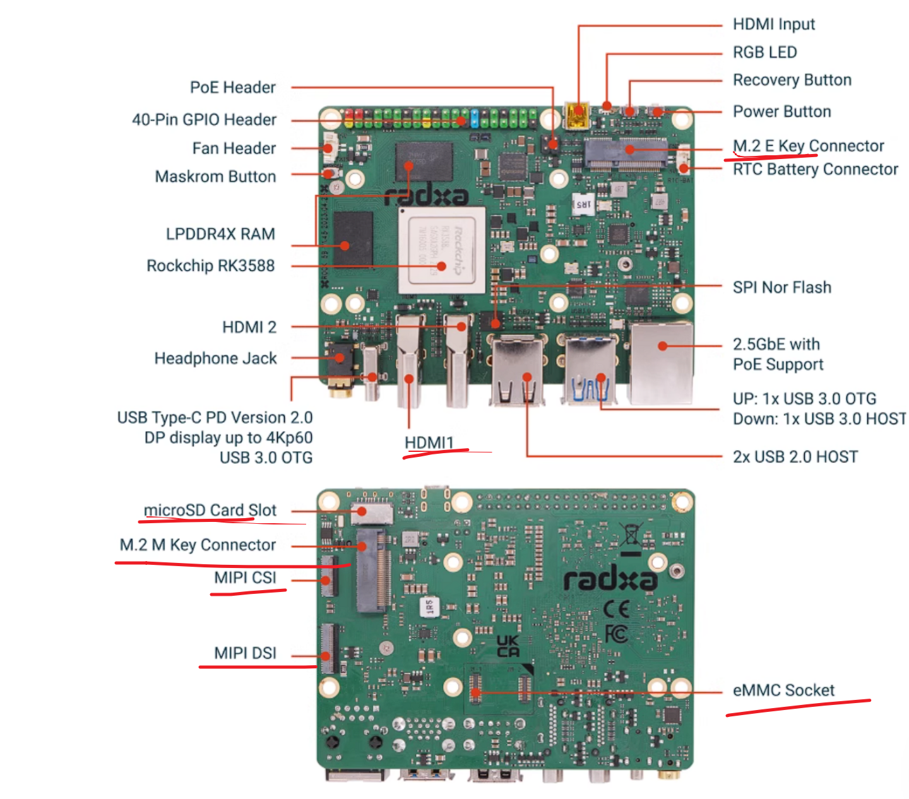
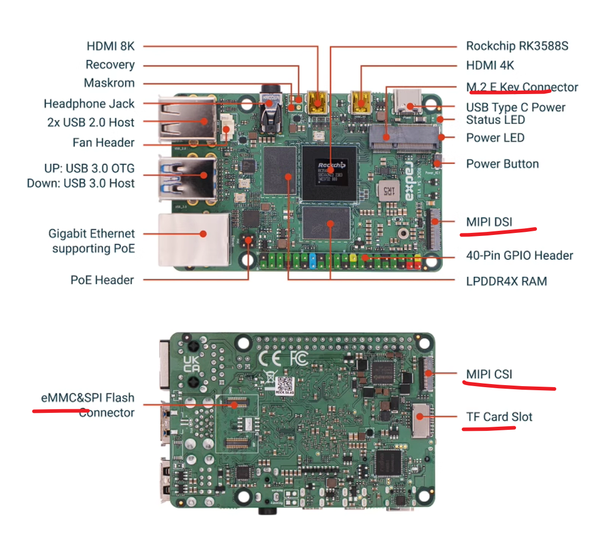
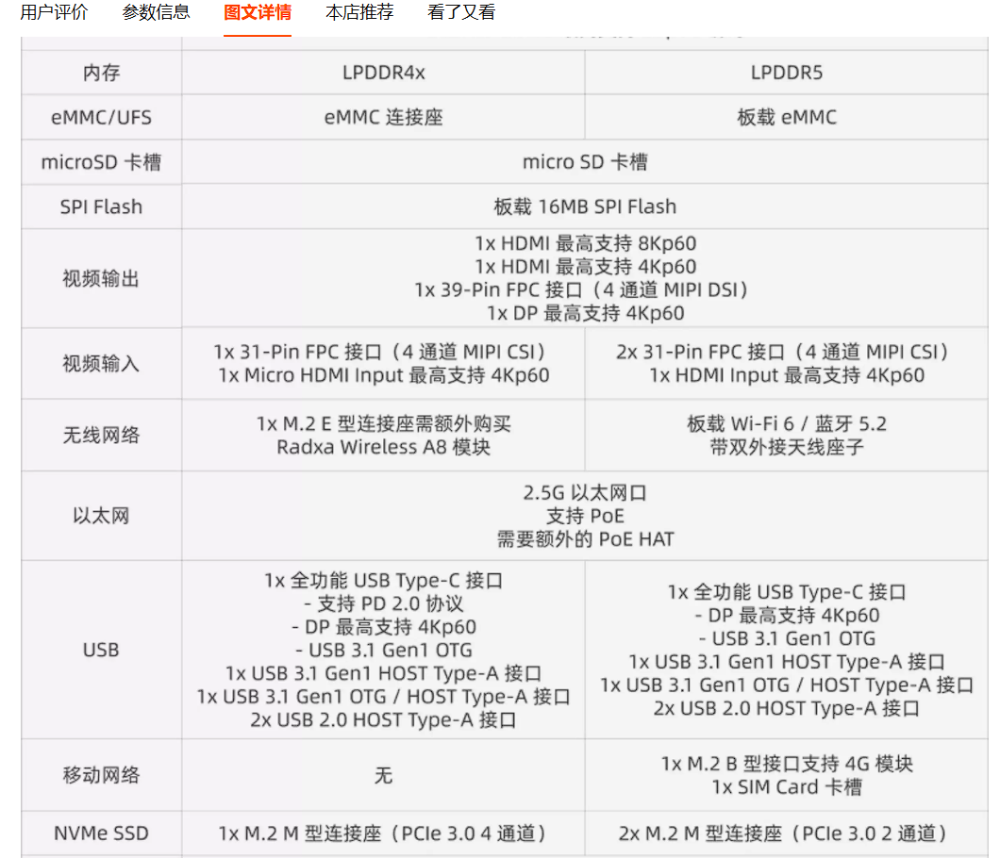
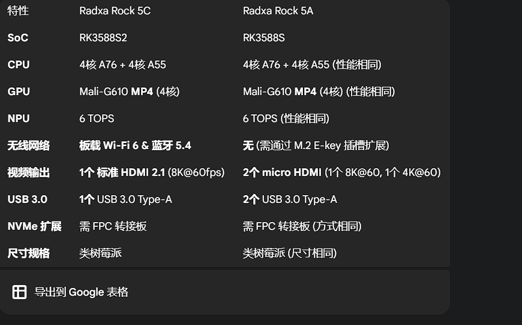

---
up:
  - "[[../moc/moc瑞芯微]]"
---
# 5b

# 5a

最显著的区别在于 PCIe 通道配置。它没有板载 Wi-Fi 和蓝牙，需要通过 M.2 E-key 插槽进行扩展。NVMe 固态硬盘则需要通过转接板实现。
专用的 M.2 M-key 插槽，支持四通道 PCIe 3.0，可以连接高速 NVMe 固态硬盘。2.5GbE 网口提供了更快的有线网络能力，而 micro-HDMI 视频输入功能是其在视频采集和处理方面的一大特色。

# 5b和5b+

它板载了 Wi-Fi 6 和蓝牙 5.2，无需再额外购买无线模块。存储方面也得到了增强，提供了两个 M.2 M-key 插槽（各支持两通道 PCIe 3.0）和一个用于蜂窝网络模块的 M.2 B-key 插槽。

# 5c 5a
