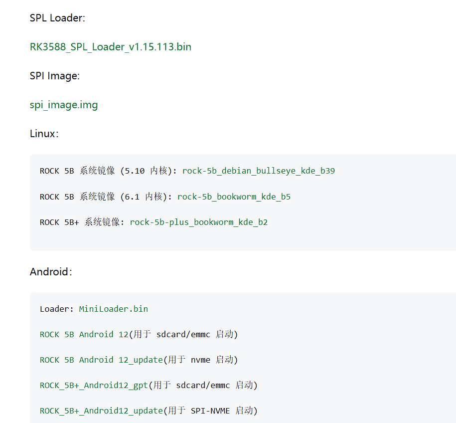
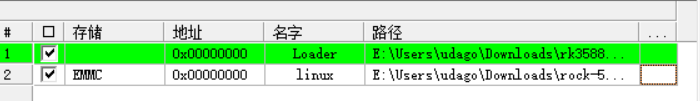
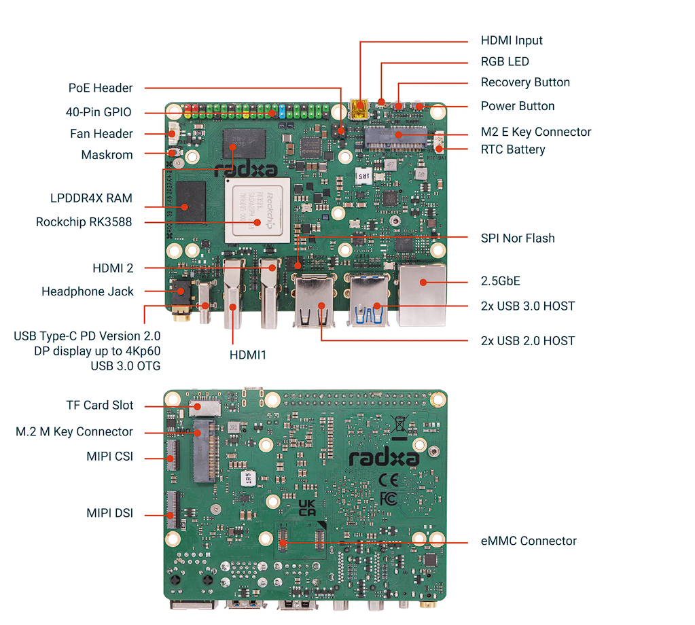
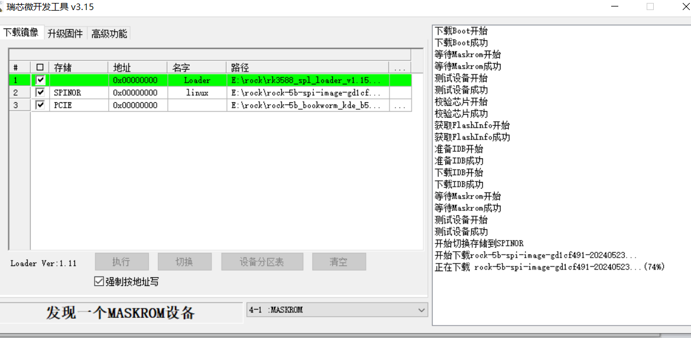
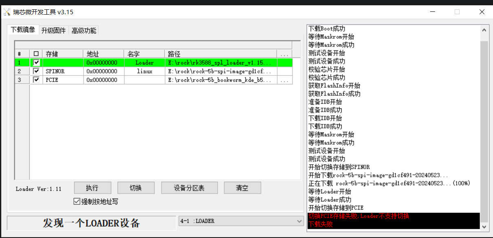
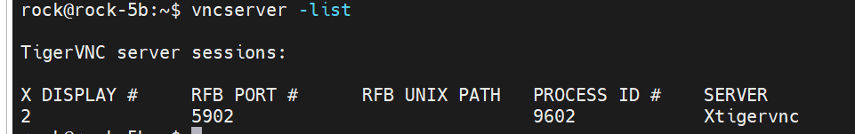

---
up:
  - "[[../moc/moc瑞芯微]]"
---
# 为什么两个loader


根据您提供的截图，这里出现两个不同的 "Loader" 是因为

**Linux 和 Android 在 Rockchip 平台上使用了不同的引导程序（Bootloader）架构和启动流程** 1。

简单来说，它们是为不同的操作系统、不同的启动方式服务的。

---

### **1. `RK3588_SPL_Loader_v1.15.113.bin`**

- **关联系统**: **Linux** 2
    
- **作用与目的**:
    
    - 这个文件通常被称为 **SPL (Secondary Program Loader)**，是开源引导程序 **U-Boot** 的一部分。
        
    - 它的主要任务是**被烧录到主板的 SPI Flash 存储芯片中**。
        
    - 烧录后，它会成为 Rock 5B 开机时最先执行的引导程序之一。它的功能是进行最基础的硬件初始化（例如DDR内存），然后去查找并加载下一阶段的引导程序（完整的 U-Boot），最终启动存储在 eMMC、SD 卡或 **NVMe 硬盘**上的 Linux 内核。
        
    - **核心优势**：通过将这个 Loader 烧录到 SPI，可以赋予 Rock 5B 从 NVMe 固态硬盘启动的能力，这是实现 Linux 系统高性能运行的关键。
        

### **2. `Miniloader.bin`**

- **关联系统**: **Android** 3
    
- **作用与目的**:
    
    - 这个文件是 **Rockchip Android 专有引导流程** 的一部分。
        
    - 它通常是在
        
        **MaskROM 模式**下，由电脑端的烧录工具（如 `RKDevTool`）最先发送到 Rock 5B 内存中运行的程序 4。
        
    - 它的功能与 SPL 类似，也是进行基础硬件初始化，但它后续加载的是 Android 系统的引导程序，并遵循一套为 Android 定制的启动链。
        
    - 从截图中可以看出，这个
	        
        `Miniloader.bin` 是与 `sdcard/emmc` 启动的 Android 12 版本相关联的 5。
        

---

### **总结对比**

您可以将它们理解为，要去同一个目的地（启动操作系统），但选择了两条不同的路线（引导流程），因此需要两位不同的“向导”（Loader）。

|特性|`RK3588_SPL_Loader` (用于 Linux)|`Miniloader.bin` (用于 Android)|
|---|---|---|
|**设计目的**|遵循开源 U-Boot 标准，提供灵活的启动选项|遵循瑞芯微 Android 专有标准，为刷写和启动 Android 服务|
|**典型位置**|烧录在主板的 **SPI Flash** 芯片中，长期驻留|作为 Android 固件包的一部分，在刷机时被临时加载到**内存**或固化在 eMMC 的特定分区|
|**关键功能**|使设备能从 **NVMe** 等多种介质启动 Linux 系统|在 MaskROM 模式下初始化设备，以便刷写和启动 Android 系统|
|**关联系统**||**Linux** (Debian, Ubuntu 等) 6||**Android** 7|
# 为什么香橙派 loader是一个
您观察到的现象非常准确，这是一个很好的问题。

香橙派（Orange Pi）在其官方固件中，特别是针对像 Orange Pi 5/5B 这样的 RK3588 开发板，通常会提供一个统一的 Loader 文件。这与您之前看到为 Linux 和 Android 提供不同 Loader 的做法不同，主要是出于**简化用户操作和统一固件架构**的考虑。

以下是几个核心原因：

### 1. 统一的引导方案 (Unified Boot Scheme)

香橙派提供的单个 Loader 文件（例如 `rk3588_loader_...bin`）是一个经过整合和定制的**多合一加载器**。它内部已经包含了能够引导不同类型操作系统所需的基础代码。

- 当您烧录 Android 系统时，这个 Loader 会执行适用于 Android 的引导流程。
    
- 当您烧录 Linux 系统（如 Ubuntu, Debian）时，它同样能够正确地加载并跳转到 U-Boot，然后继续 Linux 的启动流程。
    

它将两种引导方式最开始的通用部分（如 DDR 内存初始化）整合在了一起。

### 2. 极大地简化用户操作

这是最直接的目的。如果为不同的系统提供不同的 Loader，用户在烧录时就需要手动选择：

- “我要装 Linux，得先加载 SPL_Loader。”
    
- “我要装 Android，得先加载 Miniloader。”
    

这无疑增加了用户的操作复杂性和出错的可能性。通过提供一个统一的 Loader，用户无论安装哪个官方提供的系统，都使用同一个 Loader 文件，**烧录步骤完全一致**，大大降低了使用门槛。

### 3. 固件包的高度整合

香橙派提供的通常是一个完整的固件包（例如 `update.img`），这个包里的所有组件都是相互配套的。统一的 Loader 被设计为能够精确地识别这个固件包内部的系统分区结构（通过 `parameter.txt` 等配置文件来定义），无论里面装的是 Android 还是 Linux，它都知道下一步该做什么。

### **总结：设计理念的差异**

您可以这样理解两种做法：

- **分离式 Loader (您之前截图的例子)**：这是一种更“模块化”或“开发者导向”的做法。它清晰地将 Linux (U-Boot) 和 Android 的引导体系分离开，对于需要深度定制的开发者来说，结构更透明。
    
- **统一式 Loader (香橙派的例子)**：这是一种更“集成化”或“用户友好”的做法。它将引导流程的复杂性**“隐藏”了起来**，从用户的角度看，只有一个入口，过程更简单、更不容易出错。
    

所以，**香橙派只提供一个 Loader，是为了让所有官方系统的烧录体验保持高度一致和简便。这是一种优秀的产品设计选择，旨在让普通用户也能轻松上手。**

# 2


spi烧录切换到spi non


# 3

~·~~~


# 4 下载到nvme



如果少了spinor，即使spifflash里有也不行



应该是loader不支持切换到pcie

# 5 下载emmc


# 通用的loader可以么，而不是radxa的
这是一个非常好的问题，触及了嵌入式系统启动流程的核心。

**直接回答是：不可以。绝对不建议使用通用的 Loader，您必须使用 Radxa 为 Rock 5B 专门编译和提供的 Loader。**

下面是详细的技术解释，告诉您为什么 Loader 不是通用的：

### Loader 的核心使命：初始化“主板”而非“芯片”

很多人认为，既然都是 RK3588 芯片，Loader 应该可以通用。但实际上，Loader 的首要任务是**初始化主板级别的硬件（Board-level Hardware）**，而不仅仅是 SoC 芯片本身。

把它想象成电脑的 BIOS/UEFI。虽然很多电脑都用英特尔的酷睿 i7 处理器，但你绝对不能把戴尔主板的 BIOS 刷到惠普主板上，因为两块主板的设计是完全不同的。对于 SBC（单板计算机）来说，Loader 就扮演着类似 BIOS 的角色。

### Loader 必须“定制化”的关键硬件差异点

即使都使用 RK3588 这颗 SoC，不同厂商（如 Radxa, Orange Pi, Khadas）设计的每一款主板，在以下几个关键方面都有巨大差异，而这些差异必须由 Loader 来适配：

1. **DDR 内存初始化 (最关键)**
    
    - **颗粒不同**: 不同主板会使用不同品牌、不同型号、不同容量的 DDR 内存颗粒（如三星、海力士、镁光）。
        
    - **时序参数 (Timings)**: 每种内存颗粒都有极其复杂和精确的时序参数。Loader 必须包含针对这颗特定颗粒的正确参数，才能成功初始化内存控制器，让内存工作起来。**这是启动过程中最容易失败的一步**，参数错了系统连内存都无法使用，直接“变砖”。
        
    - **布线设计**: PCB 板上从 SoC 到内存颗粒的物理走线长度、布局都不同，这些差异也会影响信号完整性，需要在 Loader 中进行微调。
        
2. **电源管理芯片 (PMIC - Power Management IC)**
    
    - 不同主板会选用不同的 PMIC 来为 SoC 的不同部分（CPU, GPU, NPU, DDR 等）提供所需的多路、不同电压的供电。
        
    - Loader 必须知道如何通过 I2C 等总线与这颗**特定的 PMIC** 通信，以正确的顺序、正确的电压开启各个电源轨（Power Rails）。用错了 Loader，可能会导致某些部件没电无法工作，甚至因电压错误而**永久性损坏硬件**。
        
3. **时钟和晶振 (Clocks & Oscillators)**
    
    - 主板上会使用不同的外部晶振为 SoC 提供基础时钟信号。Loader 需要根据晶振的频率来配置 SoC 内部的锁相环（PLL），从而为整个系统生成正确的工作频率。
        
4. **引脚复用 (PinMux)**
    
    - RK3588 的引脚大多是多功能复用的。Radxa 的工程师在设计 Rock 5B 时，会决定哪个引脚用作 UART 调试，哪个用作 I2C，哪个用作 GPIO。这些配置信息都固化在 board-specific 的 Loader 中。一个“通用”的 Loader 不会知道 Rock 5B 的引脚是如何规划的。
        

### “通用 Loader”指的是什么？

通常所说的“通用 Loader”指的是 Rockchip (瑞芯微) 官方 SDK (软件开发套件) 中提供的**源代码**。主板制造商（如 Radxa）会获取这份通用的源代码，然后根据自己主板的硬件设计（DDR 型号、PMIC 型号、电路原理图等）进行**配置和适配**，最终**编译**出针对自己产品的、独一无二的 Loader 二进制文件（`.bin`）。

**所以，您拿到的 `rk3588_spl_loader_xxx.bin` 文件已经是“定制成品”，而不是“通用原材料”。**

---

**结论：**

为了确保您的 Rock 5B 能够成功启动且硬件安全，**请务必使用 Radxa 官方为其量身定制的 Loader 文件**。这是成功刷写和启动系统的基本前提。任何试图混用 Loader 的行为，轻则导致刷机失败、无法启动，重则有损坏硬件的风险。

# 1
## armbian -firmrock
ware-full
## nmtui
## 安装deb
sudo dpkg -i

## moonlight

```
curl -1sLf 'https://dl.cloudsmith.io/public/moonlight-game-streaming/moonlight-qt/setup.deb.sh' | sudo -E bash
sudo apt install moonlight-qt
```

要在安装 Moonlight Qt 后更新它，请运行：

```
sudo apt update
sudo apt upgrade
```

## 开机开启蓝牙
sudo systemctl enable bluetooth.service


# 备份
好的，您的问题是“如何备份安装在eMMC中的Linux系统”。这是一个非常常见的需求，尤其是在嵌入式设备和单板计算机上。

最安全、最可靠的方法是**离线备份**，也就是**从一个外部系统（比如SD卡或U盘）启动，然后对整个eMMC进行块级复制**。直接在运行中的系统里备份eMMC自身，很容易因为文件正在被读写而导致备份镜像损坏、无法使用。

以下是详细的操作步骤，这基本上是行业标准做法：

### **核心工具：`dd` 命令**

我们将使用强大的 `dd` 命令来创建整个eMMC的精确镜像。

---

### **第一步：准备一个可启动的外部介质（SD卡/U盘）**

1. **制作启动盘**: 您需要另找一张SD卡或一个U盘，并将一个可以运行的Linux系统（例如Ubuntu, Debian, Armbian等适用于您设备的版本）烧录进去。您可以使用 BalenaEtcher 或 Raspberry Pi Imager 等工具来制作。
    
2. **设置为外部介质启动**: 将您的设备设置为从这张SD卡或U盘启动。这通常需要更改设备的启动顺序（可能通过跳线、开关或在U-Boot/BIOS中设置）。
    

### **第二步：从外部介质启动并识别eMMC**

1. 插入您制作好的启动盘，然后给设备上电。系统现在会从您的SD卡或U盘加载，而不是从内置的eMMC。
    
2. 系统启动后，打开一个终端。
    
3. 使用以下命令来查看所有的块设备，并找到哪一个是您的eMMC。
    
    Bash
    
    ```
    lsblk
    # 或者
    sudo fdisk -l
    ```
    
    - 通常，**eMMC** 的设备名会是 `/dev/mmcblkX` (例如 `/dev/mmcblk0` 或 `/dev/mmcblk1`)。
        
    - 而您正在运行系统的**SD卡**，设备名可能是另一个 `/dev/mmcblkY` 或者 `/dev/sdX`。
        
    - 请务必根据磁盘的大小和分区信息来准确判断。例如，如果您的eMMC是32GB，SD卡是16GB，那么32GB的那个就是您要备份的目标。
        

### **第三-步：执行备份**

在开始之前，请准备一个容量足够大的存储设备（比如另一个U盘、移动硬盘，或者通过网络挂载的目录）来存放备份出来的镜像文件。假设您已经将一个U盘挂载到了 `/mnt/usb_drive` 目录。

**假设经过上一步确认，您的eMMC设备是 `/dev/mmcblk0`。**

#### **方法A：直接备份为 `.img` 文件（不压缩）**

这个方法最直接，但生成的镜像文件会和你的eMMC容量一样大。

Bash

```
sudo dd if=/dev/mmcblk0 of=/mnt/usb_drive/my_emmc_backup.img bs=4M status=progress
```

- `if=/dev/mmcblk0`: `if` (input file) 代表输入源，即您的eMMC。
    
- `of=/mnt/usb_drive/my_emmc_backup.img`: `of` (output file) 代表输出文件，即您要创建的镜像。
    
- `bs=4M`: 设置每次读写的块大小为4MB，可以显著提高备份速度。
    
- `status=progress`: 实时显示备份的进度。
    

#### **方法B：备份并压缩（强烈推荐）**

这个方法可以大大减小镜像文件的体积，节省存储空间。

Bash

```
sudo dd if=/dev/mmcblk0 bs=4M | gzip -c > /mnt/usb_drive/my_emmc_backup.img.gz
```

- `|` (管道符) 会把 `dd` 命令的输出实时地传递给 `gzip` 命令。
    
- `gzip -c`: `-c` 选项让 `gzip` 将压缩结果输出到标准输出，然后我们通过 `>` 将其重定向到文件。
    

如果您设备是多核CPU，可以使用 `pigz` (一个 `gzip` 的多线程版本) 来进一步加快压缩速度：

Bash

```
# 如果系统没有 pigz，先安装它
sudo apt-get update
sudo apt-get install pigz

# 使用 pigz 进行多线程压缩备份
sudo dd if=/dev/mmcblk0 bs=4M | pigz -c > /mnt/usb_drive/my_emmc_backup.img.gz
```

---

### **如何恢复备份？**

恢复操作同样需要**从外部介质启动**，并且会**完全覆盖**目标eMMC上的所有数据。

假设您要将备份文件 `my_emmc_backup.img.gz` 恢复到设备 `/dev/mmcblk0`：

Bash

```
# 先解压，然后通过管道传递给 dd 命令写入 eMMC
gunzip -c /mnt/usb_drive/my_emmc_backup.img.gz | sudo dd of=/dev/mmcblk0 bs=4M status=progress

# 如果是使用 pigz 压缩的，也可以用 pigz 来解压
pigz -dc /mnt/usb_drive/my_emmc_backup.img.gz | sudo dd of=/dev/mmcblk0 bs=4M status=progress
```

恢复完成后，关闭设备，拔掉外部启动介质（SD卡/U盘），再重新上电，系统就会从您刚刚恢复好的eMMC启动了。

**总结：** 对于备份eMMC中的整个Linux系统，最可靠的方法就是**“启动外部系统，备份内部存储”**。请务必在操作前再三确认 `if` 和 `of` 参数对应的设备，避免写错设备导致数据丢失。


# 源替换
[Ubuntu/Debian 如何更换国内 APT 源\_debian更换apt源-CSDN博客](https://blog.csdn.net/i826056899/article/details/145721355)

```

# 清华源
deb https://mirrors.tuna.tsinghua.edu.cn/debian/ bookworm main contrib non-free
# 安全更新
deb https://mirrors.tuna.tsinghua.edu.cn/debian-security/ bookworm-security main contrib non-free
# 更新与回溯
deb https://mirrors.tuna.tsinghua.edu.cn/debian/ bookworm-updates main contrib non-free
deb https://mirrors.tuna.tsinghua.edu.cn/debian/ bookworm-backports main contrib non-free

```

/etc/apt/source. list. d/
把50那几个都改为以上

更新缓存
	sudo apt update

# `rsetup` 是一个适用于 Radxa OS 的系统配置工具。
## Overlays设备树
### 安装第三方 Overlay
> rsetup 的 Install 3rd party overlay 功能既可安装设备树 overlay 文件（DTBO）也可安装源码（DTS）
 官方设备树覆盖文件仓库 radxa/overlays 的预编译文件可以[从此下载](https://github.com/radxa/overlays/actions)。

#### 获取 radxa/overlays 源码

```
git clone https://github.com/radxa/overlays.gitcd overlays
```

#### 使用 rsetup 加载 overlay

在 `rsetup` 的主界面选择 `Overlays`:

```
Configure Device Tree Overlay        
	Manage overlays        
	View overlay info        
	Install 3rd party overlay"        
	Reset overlays       
 <Ok>             <Cancel>
```

然后， 选择 `Install 3rd party overlay`:


> 以下为瑞芯微 SOC 设备树覆盖文件源码的路径:
> arch/arm64/boot/dts/rockchip/overlays/*.dts
> 如果 SOC 厂商为晶晨需要更换以上路径里的 rockchip 为 amlogic。

然后选择你需要加载的 overlay，选择之后退出 rsetup，最后重启。


> 可以使用 cat /boot/extlinux/extlinux.conf 检查参数


# 2备份


插上u盘，不是u盘的路径
df -h /media/rock/uda


```
curl -sL https://rock.sh/rockpi-backup -o rockpi-backup.sh  
chmod +x rockpi-backup.sh

```
```
sudo ./rockpi-backup.sh -o xxx.img # 进行重命名，不改变输出位置  
  
sudo ./rockpi-backup.sh -o /mnt/sda1/ # 不进行重命名，改变输出位置  
  
sudo ./rockpi-backup.sh -o /mnt/sda1/xxx.img # 进行重命名并改变输出位置
```


# 替换源


```
deb [https://mirrors.tuna.tsinghua.edu.cn/debian/](https://mirrors.tuna.tsinghua.edu.cn/debian/) bookworm main contrib non-free 
# 安全更新 
deb [https://mirrors.tuna.tsinghua.edu.cn/debian-security/](https://mirrors.tuna.tsinghua.edu.cn/debian-security/) bookworm-security main contrib non-free 
# 更新与回溯 
deb [https://mirrors.tuna.tsinghua.edu.cn/debian/](https://mirrors.tuna.tsinghua.edu.cn/debian/) bookworm-updates main contrib non-free deb [https://mirrors.tuna.tsinghua.edu.cn/debian/](https://mirrors.tuna.tsinghua.edu.cn/debian/) bookworm-backports main contrib non-free
```


# ssh 
IP a
开机自启
	sudo systemctl enable --now ssh
# vnc

#### 安装 VNC 服务器

1. 打开终端应用程序，输入以下命令更新软件包列表。

  radxa@rock-5b:~$ sudo apt-get update
	  apt-get apt都可

2. 输入以下命令安装 TigerVNC 服务器。

  radxa@rock-5b:~$ sudo apt-get install tigervnc-standalone-server
  

3. 安装 dbus-x11 依赖项以确保与 VNC 服务器的正常连接：

  radxa@rock-5b:~$ sudo apt-get install dbus-x11
  

4. 安装完成后，要完成 VNC 服务器的初始配置，请使用 vncserver 命令设置安全密码并创建初始配置文件：

  radxa@rock-5b:~$ vncserver
  

::注意 您是否要输入只允许查看的密码（y/n）？ n 提示只允许查看，您是否要选择否并输入 n，这样您就可以根据自己的情况进行远程操作，而不仅仅是观看？ :::

#### 配置 VNC 服务器

1. TigerVNC 启动后，将创建一个包含 VNC 服务器 IP 地址和端口号（通常为 5901）的 VNC 会话。要改变 VNC 服务器的配置方式，首先要使用以下命令停止运行在 5901 端口的 VNC 服务器实例：

  radxa@rock-5b :~$ vncserver -kill : 1   
	  具体是几看情况
  

2. 运行 vncserver 命令时，会在 ~/.vnc 目录中生成 xstartup。如果没有生成，请手动创建并赋予其可执行权限：

  radxa@rock-5b:~$ touch ~/.vnc/xstartup
  radxa@rock-5b:~$ chmod +x ~/.vnc/xstartup

编辑 xstartup 配置文件如下：

  ```
  radxa@rock-5b:~$ cat ~/.vnc/xstartup
  #!/bin/sh
  unset SESSION_MANAGER
  unset DBUS_SESSION_BUS_ADDRESS
  unset XDG_RUNTIME_DIR
  /etc/X11/xinit/xinitrc
  [ -x /etc/vnc/xstartup  ] && exec /etc/vnc/xstartup
  [ -r $HOME/.Xresources ] && xrdb $HOME/.Xresources
  xsetroot -solid grey
  #vncconfig -iconic &
  startkde &
  ```

3. 编辑配置后，重启 VNC 服务器：

  **radxa@rock-5b:~$ vncserver -localhost no**
	重启后重新执行


vncserver -list


192.168.24.80:2


# 如何将局域网下的另一台设备的存储挂载到另一台设备的linux上
将局域网下另一台设备的存储挂载到本地 Linux 设备上，有多种方法可以实现。最常见的三种方法是 **Samba (SMB/CIFS)**、**NFS** 和 **SSHFS**。

以下是这三种方法的详细设置步骤（假设您的挂载目标是 Linux 系统）：

---

### 方法一：使用 Samba (SMB/CIFS)

这是最通用、跨平台性最好的方法，特别适用于局域网内有 Windows 设备的混合环境。

#### 1. 在“另一台设备”（服务器端）上设置 SMB 共享

- **如果“另一台设备”是 Windows：**
    
    1. 右键点击您想共享的文件夹。
        
    2. 选择 “属性” -> “共享” 选项卡。
        
    3. 点击 “高级共享...”，勾选 “共享此文件夹”。
        
    4. 设置一个共享名称（例如 `MyShare`）。
        
    5. 点击 “权限”，确保您的用户（或 `Everyone`）有读取（或读/写）权限。
        
    6. 您还需要一个 Windows 帐户和密码用于登录。
        
- **如果“另一台设备”是 Linux：**
    
    1. 安装 Samba 服务：
        
        Bash
        
        ```
        sudo apt update
        sudo apt install samba 
        ```
        
    2. 编辑 Samba 配置文件 `/etc/samba/smb.conf`：
        
        Bash
        
        ```
        sudo nano /etc/samba/smb.conf
        ```
        
    3. 在文件末尾添加一个共享定义，例如：
        
        Ini, TOML
        
        ```
        [MyShare]
           comment = My Shared Folder
           path = /path/to/your/shared_folder  # 替换为实际路径
           read only = no
           browsable = yes
        ```
        
    4. 为 Samba 创建一个独立的用户和密码（这个用户必须也是系统用户）：
        
        Bash
        
        ```
        sudo smbpasswd -a your_username # 替换为您的 Linux 用户名，然后设置密码
        ```
        
    5. 重启 Samba 服务：
        
        Bash
        
        ```
        sudo systemctl restart smbd nmbd
        ```
        
- **如果“另一台设备”是 NAS（如群晖、威联通）：**
    
    - 通常在 NAS 的网页管理界面中，找到 “文件服务” -> “SMB” 或 “Windows 文件共享”，启用它并设置共享文件夹即可。
        

#### 2. 在您的 Linux（客户端）上挂载 SMB 共享

1. **安装 CIFS 工具：**
    
    Bash
    
    ```
    sudo apt update
    sudo apt install cifs-utils
    ```
    
2. 创建挂载点：
    
    这是本地的一个空文件夹，用于访问网络存储。
    
    Bash
    
    ```
    sudo mkdir /mnt/my_network_share
    ```
    
3. **手动挂载（临时）：**
    
    Bash
    
    ```
    # 替换 //SERVER_IP 为您服务器的局域网 IP 地址
    # 替换 MyShare 为您设置的共享名称
    # 替换 your_username 和 your_password
    sudo mount -t cifs //SERVER_IP/MyShare /mnt/my_network_share -o username=your_username,password=your_password
    ```
    
    - 如果服务器是 Windows，您可能需要指定域（工作组）：`-o username=your_username,password=your_password,domain=WORKGROUP`
        
4. 自动挂载（开机启动）：
    
    为了安全，不推荐直接在 /etc/fstab 中写密码。
    
    a. 创建一个凭据文件：
    
    bash sudo nano /etc/samba/credentials
    
    b. 在文件中写入：
    
    username=your_username password=your_password
    
    c. 设置权限，防止他人读取：
    
    bash sudo chmod 600 /etc/samba/credentials
    
    d. 编辑 /etc/fstab 文件：
    
    bash sudo nano /etc/fstab
    
    e. 在末尾添加一行：
    
    # 替换 IP、共享名和挂载点 //SERVER_IP/MyShare /mnt/my_network_share cifs credentials=/etc/samba/credentials,iocharset=utf8,uid=1000,gid=1000 0 0
    
    * uid=1000,gid=1000 通常是您本地 Linux 用户的 ID，确保您对挂载的文件夹有所有权。您可以通过在终端输入 id 命令来查看您的 uid 和 gid。
    
5. **测试 fstab 配置：**
    
    Bash
    
    ```
    sudo mount -a 
    ```
    
    如果没有报错，并且 `df -h` 能看到挂载点，说明配置成功。
    

---

### 方法二：使用 NFS (Network File System)

这是 Linux/Unix 之间共享文件的传统方法，通常性能比 Samba 稍好，但配置用户权限（UID/GID 映射）可能复杂一些。

#### 1. 在“另一台设备”（服务器端，必须是 Linux/NAS）上设置 NFS 导出

1. **安装 NFS 服务器：**
    
    Bash
    
    ```
    sudo apt update
    sudo apt install nfs-kernel-server
    ```
    
2. 配置导出目录：
    
    编辑 /etc/exports 文件：
    
    Bash
    
    ```
    sudo nano /etc/exports
    ```
    
    添加一行来指定要共享的目录和允许访问的客户端：
    
    ```
    # 替换 /path/to/your/shared_folder 为实际路径
    # 替换 CLIENT_IP 为您客户端 Linux 的 IP 地址（或使用 192.168.1.0/24 允许整个子网）
    /path/to/your/shared_folder CLIENT_IP(rw,sync,no_subtree_check)
    ```
    
3. **应用配置并重启服务：**
    
    Bash
    
    ```
    sudo exportfs -a
    sudo systemctl restart nfs-kernel-server
    ```
    

#### 2. 在您的 Linux（客户端）上挂载 NFS 共享

1. **安装 NFS 客户端工具：**
    
    Bash
    
    ```
    sudo apt update
    sudo apt install nfs-common
    ```
    
2. **创建挂载点：**
    
    Bash
    
    ```
    sudo mkdir /mnt/nfs_share
    ```
    
3. **手动挂载（临时）：**
    
    Bash
    
    ```
    # 替换 SERVER_IP 和服务器上的路径
    sudo mount -t nfs SERVER_IP:/path/to/your/shared_folder /mnt/nfs_share
    ```
    
4. 自动挂载（开机启动）：
    
    编辑 /etc/fstab：
    
    Bash
    
    ```
    sudo nano /etc/fstab
    ```
    
    添加一行：
    
    ```
    # 推荐使用 auto 和 x-systemd.automount 选项
    # 它们会在访问时才挂载，并防止开机时因网络未就绪而卡住
    SERVER_IP:/path/to/your/shared_folder /mnt/nfs_share nfs auto,x-systemd.automount,defaults 0 0
    ```
    
5. **测试 fstab 配置：**
    
    Bash
    
    ```
    sudo systemctl daemon-reload
    sudo mount -a 
    ```
    

---

### 方法三：使用 SSHFS (SSH File System)

如果“另一台设备”已经开启了 SSH 服务（几乎所有 Linux 服务器和 NAS 默认都支持），这是最简单快捷的方法，并且数据传输是加密的。

#### 1. 在“另一台设备”（服务器端）上设置

确保 SSH 服务已安装并正在运行：

Bash

```
sudo apt install openssh-server
sudo systemctl status ssh # 确保是 active (running)
```

#### 2. 在您的 Linux（客户端）上挂载

1. **安装 SSHFS：**
    
    Bash
    
    ```
    sudo apt update
    sudo apt install sshfs
    ```
    
2. （可选）将您的用户添加到 fuse 组：
    
    （在新版系统中可能不需要，但如果遇到权限问题可以试试）
    
    Bash
    
    ```
    sudo gpasswd -a $USER fuse
    # 执行后需要重新登录（注销再登录）才能生效
    ```
    
3. **创建挂载点（可以在您的主目录中，无需 sudo）：**
    
    Bash
    
    ```
    mkdir ~/remote_server_files
    ```
    
4. **手动挂载（作为普通用户）：**
    
    Bash
    
    ```
    # 替换 username、SERVER_IP 和远程路径
    # 如果您想挂载对方的整个根目录，路径就是 : /
    # 如果想挂载对方的主目录，路径就是 :
    sshfs username@SERVER_IP:/path/to/remote/folder ~/remote_server_files
    ```
    
    输入对方的 SSH 密码后，远程文件系统就会出现在 `~/remote_server_files` 目录中。
    
5. **卸载：**
    
    Bash
    
    ```
    fusermount -u ~/remote_server_files
    ```
    

---

### 如何选择？

- **Samba (SMB)：** 当您的局域网中有 Windows 设备，或者您需要最广泛的兼容性时（例如，也想从手机或 Mac 访问），请使用 Samba。
    
- **NFS：** 当服务器和客户端都是 Linux，并且您追求最佳性能时（例如，流式传输大文件、数据库存储），请使用 NFS。
    
- **SSHFS：** 当您需要快速、临时、安全地访问另一台 Linux 设备上的文件，且不想配置复杂的 Samba 或 NFS 服务时，SSHFS 是最简单的选择。
    

### 重要提示：防火墙

请确保“服务器端”设备的防火墙允许来自“客户端”的连接：

- **Samba：** 需要打开 TCP 端口 139 和 445。
    
- **NFS：** 需要打开 TCP/UDP 端口 2049 和 111 (portmapper)。
    
- **SSHFS：** 需要打开 TCP 端口 22 (SSH 默认端口)。
# kde con  
剪切板共享
	串流软件间剪切板共享了

